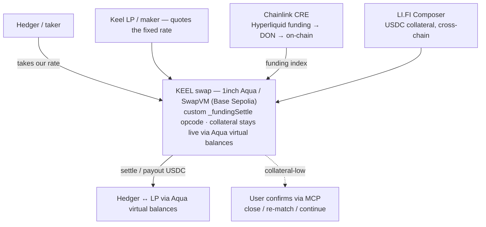
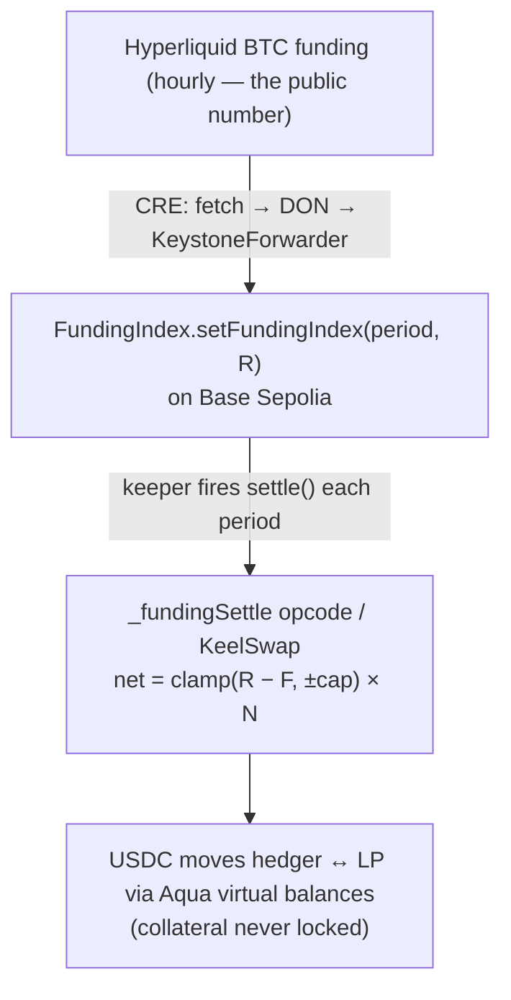

# Keel

> On-chain fixed-funding-rate swaps — built natively on 1inch Aqua, with collateral that never goes idle. Swap your *variable* perp funding for a *fixed* one, in one click.

- **Design doc** (source of truth): [`docs/design-doc.md`](docs/design-doc.md)
- **Bounty integrations** (1inch · Chainlink · LI.FI — diagrams + code): [`docs/bounty-integrations.md`](docs/bounty-integrations.md)
- **Settlement core**: [`packages/contracts`](packages/contracts) · **Aqua opcode**: [`packages/contracts/src/swapvm`](packages/contracts/src/swapvm)

---

## The problem

Perpetual-futures *funding* is the floating fee traders pay or earn every hour. It swings violently and nobody can lock it in — the variable cost that gutted Ethena (~$16.6B → ~$5.6B as its funding yield collapsed). TradFi solved this 40 years ago with the interest-rate swap (~$469T notional). Crypto built $60T+/yr of this risk; the safety net is still nascent.

## The solution

Keel is a funding-rate swap: **variable → fixed**. It never touches your Hyperliquid position — it settles against a *public number* (the funding rate, read by Chainlink CRE), like rain insurance pays on rainfall without controlling the weather.

- **Hedger (the customer / taker)** — a leveraged perp long. Pays fixed, receives floating → their variable funding is cancelled, leaving a flat locked rate. Takes our offer in one click.
- **Keel LP (us / maker)** — quotes a consistent fixed rate and stands as the counterparty, so a hedger locks instantly. Receives fixed, pays floating; earns the premium when funding stays calm, pays out (bounded per period) when it spikes.
- **The protocol stays neutral** — the contract only custodies and settles; the LP provides the liquidity, exactly as an exchange is neutral while market-makers quote. *(Speculators that take the LP's side are phase 2.)*

## How the swap works

Each period, the two legs exchange the fixed-vs-realized-floating difference from pre-locked collateral:

```
net = clamp(realized − fixed, ±cap) × notional       (credit to the hedger)
  realized > fixed  → hedger receives, LP pays        (funding spiked — the payout that hedges the perp)
  realized < fixed  → hedger pays, LP receives        (the premium for certainty)
```

**No default, by design:** funding is capped per period, and each side pre-locks at least one period's worst case (`cap × notional`). The most anyone can owe in a period is already paid up front; if a side is drained, only that side closes and the counterparty is paid in full.

## The brink decision

When a side's collateral can no longer cover one more worst-case period (`remaining < cap × notional`), Keel does not close blindly. The MCP agent prepares the choice — **close · re-match · continue (top up)** — and the user confirms it. *Agent proposes, user confirms:* the decision that moves money at the brink is made by a person.

## Integrations

| Component | What it does | Where |
|-----------|--------------|-------|
| **1inch Aqua / SwapVM** | Custom `_fundingSettle` instruction settles a period as `amountOut = net`; collateral stays live via virtual balances | `packages/contracts/src/swapvm` |
| **Chainlink CRE** | Funding-rate oracle: reads Hyperliquid BTC funding → DON consensus → on-chain `FundingIndex` | `packages/cre` · [`docs/bounty-integrations.md`](docs/bounty-integrations.md) |
| **LI.FI Composer** | Cross-chain collateral onboarding: fund + open the hedge with USDC from any chain | (integration lead) |
| **Settlement core** | `KeelSwap` (matched swap, settlement, no-default) + `FundingIndex` (write-once latch) | `packages/contracts/src` |

## Architecture



## The settlement loop



## Status

| Component | Status | Where |
|-----------|--------|-------|
| Settlement core (`KeelSwap` + `FundingIndex`) | **Built · 25 tests** | `packages/contracts/src` |
| Custom SwapVM opcode (`_fundingSettle` + router + program) | **Built · unit + e2e** (settlement moves real USDC via Aqua) · double-settle guarded; Sepolia deploy pending | `packages/contracts/src/swapvm` |
| Deploy script + wiring test (Base Sepolia) | **Built · 1 test** | `packages/contracts/script` |
| Chainlink CRE funding oracle | Planned (M2) | `packages/cre` |
| LI.FI cross-chain onboarding | Planned | integration lead |
| Keel MCP (agent front door) | Planned (M7) | `packages/mcp` |
| Web app (lock UI + Ethena replay) | Planned (M5) | `apps/web` |
| Base Sepolia deployment | Pending | — |

## Repository layout

```
keel/
├── docs/                 # design doc (source of truth), build plan, bounty + CRE notes
├── packages/
│   ├── contracts/        # Foundry (single env) — settlement core (src/) + SwapVM opcode (src/swapvm/) + deploy (script/)
│   ├── cre/              # Chainlink CRE workflow: Hyperliquid funding → on-chain index
│   ├── keeper/           # per-period settle() trigger
│   └── mcp/              # Keel MCP: read funding + operate the swap; brink → user confirm
└── apps/
    └── web/              # lock UI + the Ethena replay demo
```

## Quickstart

Everything is one Foundry package:

```bash
cd packages/contracts
pnpm install          # @1inch/swap-vm + @1inch/aqua (needed to build the SwapVM opcode)
forge test            # 30 tests
```

Deploy to Base Sepolia:

```bash
forge script script/Deploy.s.sol:Deploy \
  --rpc-url $BASE_SEPOLIA_RPC_URL --private-key $PRIVATE_KEY --broadcast
# writes deployments.json
```

## Tech stack

| Layer | Choice |
|-------|--------|
| Settlement contracts | Solidity 0.8.30, Foundry |
| Aqua app | 1inch SwapVM custom instruction (Foundry) |
| Funding oracle | Chainlink CRE (reads Hyperliquid funding) |
| Cross-chain onboarding | LI.FI Composer |
| Settlement currency / chain | USDC on Base Sepolia |
| Agent front door | Keel MCP |

## Security & soundness

- **No-default invariant** — per-period cap + pre-locked `cap × notional` per side; settlement only *moves* collateral between parties (conserved), so a credited party is always fully backed.
- **Write-once funding index** — a period's realized funding is immutable once it settles real cashflow; only the CRE forwarder can write.
- **Deterministic core** — no AI in the settlement math; the agent operates but cannot override the brink (a human checkpoint).
- **Custom errors + explicit leg convention** — `net = realized − fixed` is fixed and unit-tested.

## Team

Keel — ETHGlobal New York 2026.

## License

MIT
