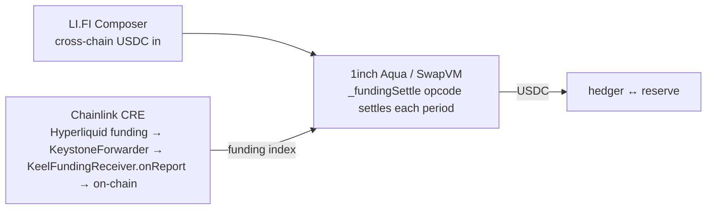
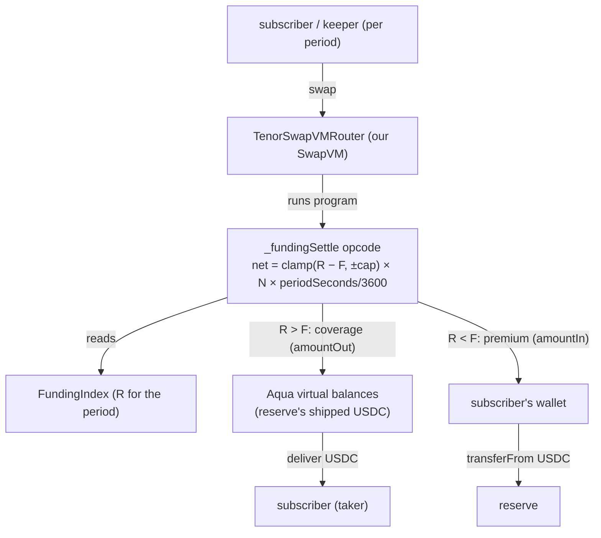
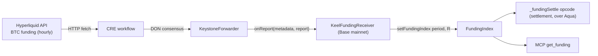
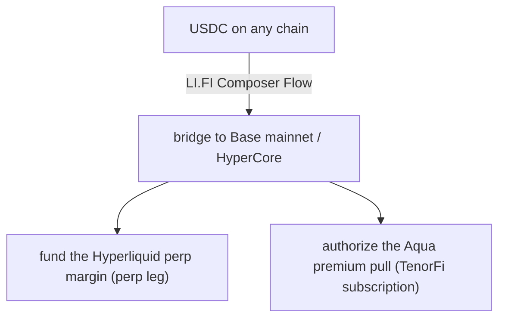

# TenorFi — Bounty Integrations

> How each sponsor tech is integrated, in detail — with diagrams and code. **The test every
> integration must pass:** *pull it out and the product breaks.*
> **Target bounties: 1inch · Chainlink · LI.FI.** Deploy chain: **Base mainnet.** Funding data
> source: **Hyperliquid** (read by CRE).
>
> ✅ **Model (live & deployed):** TenorFi is a **subscription** — the subscriber posts **no collateral**.
> A **single** SwapVM order settles both directions each period: when funding is **below** the fixed rate
> the opcode pulls the **premium straight from the subscriber's wallet** just-in-time (`amountIn`), and
> when funding is **above** it the reserve **covers** the gap from its shipped Aqua balance (`amountOut`)
> (see [`flows.md`](flows.md)). The code in this doc reflects what's **live** on Base mainnet.

## Summary

| Bounty | Prize | Load-bearing? | Pull it → |
|---|---|---|---|
| **1inch — Build an Aqua App** | $5,000 | ✅ | no settlement venue / no Aqua-native swap |
| **Chainlink — Best workflow with CRE** | $6,000 | ✅ | no funding number → nothing to settle |
| **LI.FI — Composer** | $4,000 | ✅ | no one-click cross-chain way to fund + open the hedge |



---

## Prize submission answers (ETHGlobal form)

> Copy-paste-ready answers for the per-prize submission form. Code links point at `main`.

### 1inch — Build an Aqua App ($5,000)

**How are you using this Protocol / API?**
We built a **custom SwapVM instruction**, `_fundingSettle` — a *modified SwapVM opcode / our own
instruction* (the track's highest-scoring path) — that turns a "swap" into a periodic funding-rate
settlement: a sophisticated DeFi position (a funding-rate swap / interest-rate-swap-for-perps), not a
spot trade. It reads an on-chain funding index, nets fixed-vs-realized, clamps to a per-period cap,
and settles over **Aqua virtual balances** so collateral stays live in the user's wallet. We deployed
our **own SwapVM router** (the opcode appended to Aqua's opcode set) on Base mainnet, reusing the
canonical Aqua. Pull Aqua out and there is no settlement venue. Real USDC moves through the opcode on
both a Base-mainnet fork and the live deployment.

**Link to the line of code:**
- Custom opcode: `https://github.com/0xYudhishthra/TenorFi/blob/main/packages/contracts/src/swapvm/FundingSettle.sol#L66`
- Opcode registration into Aqua's set: `https://github.com/0xYudhishthra/TenorFi/blob/main/packages/contracts/src/swapvm/TenorOpcodes.sol#L29`
- Our SwapVM router (`Simulator, SwapVM, TenorOpcodes`): `https://github.com/0xYudhishthra/TenorFi/blob/main/packages/contracts/src/swapvm/TenorSwapVMRouter.sol#L15`
- Live on Base mainnet: router `0xba93ebc0A6a24980703423C3CE729F15eEDA099B`, program `0xd04Aa86aB1bd11834931b667f918B945f6556174` (Basescan-verified).

**Ease of use (1–10): 6.** Aqua + SwapVM are powerful but the custom-opcode path is sparsely
documented — we read the source to find the `SwapVM(aqua, name, version)` constructor (3 args), the
`TakerTraits` struct fields, how to append an opcode via an `_opcodes()` override at a stable index,
and the `amountIn`/`amountOut` register + `taker = msg.sender` semantics.

**Additional feedback for the sponsor.** A worked "custom opcode" example (beyond AMM/options) would
have saved hours — specifically: registering a new instruction, the `ProgramBuilder`/`MakerTraits`/
`TakerTraits` flow end-to-end, that the opcode can compute `amountIn` (not just `amountOut`), and that
`ctx.query.taker` is the caller. The virtual-balance model is excellent; just surface it in docs.

### Chainlink — Best workflow with CRE ($6,000)

**How are you using this Protocol / API?**
A **CRE workflow** fetches BTC funding from the Hyperliquid API on a cron, reaches **DON median
consensus**, scales it to a signed 1e18 per-period rate, and writes `(period, value)` on-chain through
the **KeystoneForwarder** into our `IReceiver` consumer (`onReport`) → `FundingIndex`. It's the
oracle the entire settlement reads — external API → DON consensus → on-chain state change, verified
with a real on-chain write.

**Link to the line of code:**
- Workflow (fetch → consensus → `writeReport`): `https://github.com/0xYudhishthra/TenorFi/blob/main/packages/cre/keel-funding/workflow.ts#L170`
- On-chain consumer `onReport`: `https://github.com/0xYudhishthra/TenorFi/blob/main/packages/contracts/src/KeelFundingReceiver.sol#L85`
- Live on Base mainnet: receiver `0x7b7Ca2269f865C3448015173D433CcD7782aF582`, index `0x545f162204A92CEbeb12AA0A4AaDF777d6905005`; verified write at period 494834.

**Ease of use (1–10): 8.** The `@chainlink/cre-sdk` workflow model (cron trigger → HTTP capability →
`ConsensusAggregationByFields` → `writeReport`) was clean, and the canonical `IReceiver` consumer
pattern mapped directly to our contract.

**Additional feedback for the sponsor.** More end-to-end examples of `writeReport` ABI-encoding into a
custom consumer (the `(period, value)` decode side) and of non-price external data sources (we use a
venue funding rate) would help. Documenting the bun-based toolchain expectations up front would also
smooth setup.

### LI.FI — Most Innovative Composer Application ($4,000)

**How are you using this Protocol / API?**
A **LI.FI Composer Flow** is the one-click on-ramp and a **core part** of the product: it bridges the
user's USDC from any chain to Base and, in a single signature, composes the whole onboarding into one
Flow — fund the Hyperliquid perp leg **and** activate the TenorFi position — so the user opens both
legs of the delta-neutral hedge in one transaction instead of assembling it by hand across two venues.
Composer isn't cosmetic: the hedge only works if both legs open together.

**Link to the line of code:**
- Composer flow: `https://github.com/0xYudhishthra/TenorFi/blob/main/packages/lifi/src/execute.ts`
- Hedge/onboarding orchestration: `https://github.com/0xYudhishthra/TenorFi/blob/main/packages/lifi/src/hedge.ts`

**Ease of use (1–10):** _(integration lead to confirm.)_

**Additional feedback for the sponsor.** _(integration lead to confirm — note whether a single
Composer Flow can chain an arbitrary contract call alongside the HyperCore deposit, or if two
sequenced calls were needed.)_

---

## 1inch — Build an Aqua App ($5,000)

**What we build.** A custom **SwapVM instruction `_fundingSettle`** that turns a swap into one
period's funding settlement: it reads the latched funding rate, nets it against the locked fixed
rate, clamps to the per-period cap, and scales the per-hour net to the settlement window
(`× periodSeconds / 3600`). It is registered in our own router (`TenorSwapVMRouter`, which extends
`TenorOpcodes` → `AquaOpcodes` and appends the opcode) and exercised via a program built by
`TenorFundingProgram`.

SwapVM is one-directional (maker → taker), but a funding subscription is two-sided — so we settle it
with a **single order** that computes a signed net and routes **either register**: when `realized > fixed`
the reserve (maker) **covers** the gap via `amountOut` from its shipped Aqua balance; when
`realized < fixed` the opcode sets `amountIn` and SwapVM pulls the **premium from the subscriber's
wallet** just-in-time (with a 1-wei marker `amountOut`, since SwapVM requires the taker to receive
something). One order works because `MakerTraits.validate` only requires `amountIn > 0 ||
allowZeroAmountIn`. The order is **bound to one subscriber** (`taker = msg.sender`) — it reverts
`UnauthorizedTaker` if anyone else tries to settle it, and each `(order, period)` settles once.

> Canonical end-to-end flow (onboarding + per-period settlement, with diagrams): [`flows.md`](flows.md).



**The opcode** (`packages/contracts/src/swapvm/FundingSettle.sol`):

```solidity
function _fundingSettle(Context memory ctx, bytes calldata args) internal {
    (address fundingIndex, int256 fixedRate, uint256 cap, uint256 notional,
     uint256 periodSeconds, address subscriber, address settlementToken) =
        abi.decode(args, (address, int256, uint256, uint256, uint256, address, address));

    if (ctx.query.taker != subscriber) revert UnauthorizedTaker();   // bound to its subscriber

    uint256 period = block.timestamp / periodSeconds;                // derived on-chain; program stays fixed
    (int256 realized, bool isSet) = IFundingIndex(fundingIndex).getFundingIndex(period);
    require(isSet, FundingNotSet());

    if (!ctx.vm.isStaticContext) {                                   // once per (order, period)
        if (settled[ctx.query.orderHash][period]) revert AlreadySettled();
        settled[ctx.query.orderHash][period] = true;
    }

    int256 diff = _clamp(realized - fixedRate, cap);                 // clamp(R − F, ±cap), per-hour
    int256 amt = (diff * int256(notional) * int256(periodSeconds))   // scale to this window
        / (int256(RATE_ONE) * int256(FUNDING_PERIOD_SECONDS));       // (× periodSeconds / 3600)

    if (amt > 0) {                                                   // R > F: reserve covers the gap
        if (ctx.query.tokenOut != settlementToken) revert WrongToken();
        ctx.swap.amountOut = uint256(amt);                          //   → paid to subscriber
    } else if (amt < 0) {                                            // R < F: pull premium from wallet
        if (ctx.query.tokenIn != settlementToken) revert WrongToken();
        ctx.swap.amountIn = uint256(-amt);                          //   transferFrom subscriber → reserve
        ctx.swap.amountOut = 1;                                     //   1-wei marker (SwapVM needs > 0)
    }                                                               // amt == 0: nothing moves
}
```

**Registering the opcode** (`TenorOpcodes.sol`) — appended at the end of the Aqua set so existing
indices are preserved; `ProgramBuilder.findOpcode` resolves it by function pointer:

```solidity
function _opcodes() internal pure override
    returns (function(Context memory, bytes calldata) internal[] memory result)
{
    function(Context memory, bytes calldata) internal[] memory base = AquaOpcodes._opcodes();
    result = new function(Context memory, bytes calldata) internal[](base.length + 1);
    for (uint256 i = 0; i < base.length; i++) result[i] = base[i];
    result[base.length] = _fundingSettle;
}
```

**Why it's load-bearing.** The swap *literally executes as our opcode* — Aqua/SwapVM is the
settlement engine, not a wrapper. A funding-rate swap is a novel "sophisticated DeFi position" (a
derivative), and "define your own instruction" is the invited use. **Aqua pulls the fixed premium
straight from the user's wallet just-in-time — they lock up zero collateral** (the headline edge vs.
Strips/IPOR, which lock margin dead for weeks). **SwapVM is scored higher** — and we use it for real.

**Status / qualification.** Built; opcode unit-tested + a deploy-wiring test in the single Foundry
package. Settlement is one token, one direction (`tokenIn ≠ tokenOut` is enforced, so the hedge
position is the `tokenIn` with `amountIn = 0` via `allowZeroAmountIn`; USDC is `tokenOut`).
Qualification: onchain token transfer in the demo ✓ · incremental git history ✓ · SwapVM used ✓.

---

## Chainlink — Best workflow with CRE ($6,000, up to 3×$2k)

**What we build.** A CRE workflow that reads BTC funding from the **Hyperliquid API**, reaches DON
consensus, and writes it on-chain via the canonical consumer path — the KeystoneForwarder calls
`KeelFundingReceiver.onReport`, which decodes `(period, value)` and forwards to
`FundingIndex.setFundingIndex(period, value)`. There is no on-chain funding-rate oracle — without CRE
there is no number to settle against.



**The consumer** (`packages/contracts/src/KeelFundingReceiver.sol`) implements Chainlink's
`IReceiver` + ERC-165. The forwarder calls `onReport`, which decodes `(period, value)` from the
report and writes the latch; it is idempotent (skips an already-set period) and also accepts an
owner-rotatable EOA `relayer` as the live-demo fallback.

```solidity
function onReport(bytes calldata, bytes calldata report) external override {
    if (msg.sender != forwarder && msg.sender != relayer) revert NotAuthorized();
    (uint256 period, int256 value) = abi.decode(report, (uint256, int256));
    if (fundingIndex.isSet(period)) { emit ReportSkipped(period); return; }
    fundingIndex.setFundingIndex(period, value);
}
```

**The on-chain latch** (already shipped, `packages/contracts/src/FundingIndex.sol`) — the receiver is
wired in as its `forwarder`:

```solidity
function setFundingIndex(uint256 period, int256 value) external onlyForwarder {
    if (isSet[period]) revert AlreadySet(period);   // write-once per period
    _value[period] = value;
    isSet[period] = true;
    emit FundingIndexSet(period, value);
}
```

**Conventions (locked).**
- `value = R = AFR` (actual funding rate), **signed `int256`, scale `1e18`, PER-PERIOD** — funding can go negative.
- **Annualized → per-period conversion happens OFF-CHAIN, in the CRE workflow.** The contract never sees an annualized rate.
- `period = floor(unixSeconds / PERIOD_SECONDS)`, `PERIOD_SECONDS = 120` for the demo. Everyone (contract, keeper, UI, MCP) uses this exact formula.
- Set the latch's `onlyForwarder` to the `KeelFundingReceiver` (rotatable via `setForwarder`); the receiver in turn gates `onReport` to the CRE KeystoneForwarder (+ the relayer fallback).

**Hyperliquid funding source** (verify schema on the day):
- `POST https://api.hyperliquid-testnet.xyz/info`
  - current: `{"type":"metaAndAssetCtxs"}` → asset ctx includes `funding`
  - history: `{"type":"fundingHistory","coin":"BTC","startTime":<ms>}` → `[{coin, fundingRate, premium, time}]`
- HL `fundingRate` is hourly fractional (e.g. `"0.0000125"`); convert to per-period `1e18` signed in the workflow.

**Why it's load-bearing.** Canonical CRE shape: **external API → DON consensus → on-chain state
change** (`setFundingIndex`), not a UI reading a feed. The index is consumed by two parts of the
system — the **`_fundingSettle` opcode** (the settlement path, over Aqua) and the MCP's `get_funding`.

**Qualification.** CRE workflow as orchestration layer ✓ · integrates a blockchain with an external
API (Hyperliquid) ✓ · a successful CRE CLI simulation qualifies (they deploy it live for you) — land
**≥1 real on-chain write** ✓ · makes an on-chain state change (not a UI read) ✓.

**Build steps (Axel).** (1) Base mainnet RPC; CRE on Base mainnet is confirmed — chain name
`ethereum-mainnet-base-1`, selector `15971525489660198786`, production KeystoneForwarder
`0xF8344CFd5c43616a4366C34E3EEE75af79a74482` (simulation MockForwarder
`0x5e342a8438b4f5d39e72875fcee6f76b39cce548`). Get the deployed `KeelFundingReceiver` + `FundingIndex`
from `deployments.json`. (2) Write the workflow: HTTP fetch HL BTC funding → DON consensus → convert
annualized→per-period → encode `(period, value)` → `writeReport` targeting the receiver. (3) Simulate
via CRE CLI (deploy/rotate the receiver's forwarder to the MockForwarder, then `setForwarder()` back to
production). (4) Land one real on-chain write; hand the tx hash to the submission.

**Fallback.** If the DON is flaky by the checkpoint, the authorized **EOA relayer** calls
`KeelFundingReceiver.onReport` with the real API-derived per-period index for the live loop — same
code path, no contract change — but keep ≥1 real CRE write for the bounty.

---

## LI.FI — Composer ($4,000)

**What we build.** One-click onboarding: a LI.FI Composer Flow bridges the user's USDC from any chain
and, in the same flow, (a) funds the Hyperliquid perp (HyperCore) margin and (b) activates the TenorFi
subscription (authorizes Aqua to pull the fixed premium — **no collateral deposit into TenorFi**). The MCP
uses Composer as its execution layer (Agentic Workflows track). *(Section owned by the integration lead;
design-doc §6 has the flow.)*



**Why it's load-bearing.** A hedger's capital is rarely already on the settlement chain; without
LI.FI, funding the perp and activating the subscription is a manual multi-step bridge. Composer makes
"fund the perp + start the subscription" a single confirmation. **Open item (integration lead):** confirm
a single Flow can chain the Aqua authorization alongside the HL deposit; else two sequenced calls behind
one MCP confirmation.

---

## Honesty rules (say these on stage)

- **Never claim "first"** — Rho is live (see design-doc §12). We compete on Aqua-native execution +
  zero user collateral (premium pulled as you go) + the Ethena demo.
- **Real vs scripted:** the lock + USDC settlements are real (Base mainnet); the Ethena crash is a
  *replay* of real historical funding on a slider.
