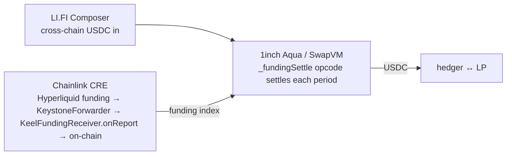
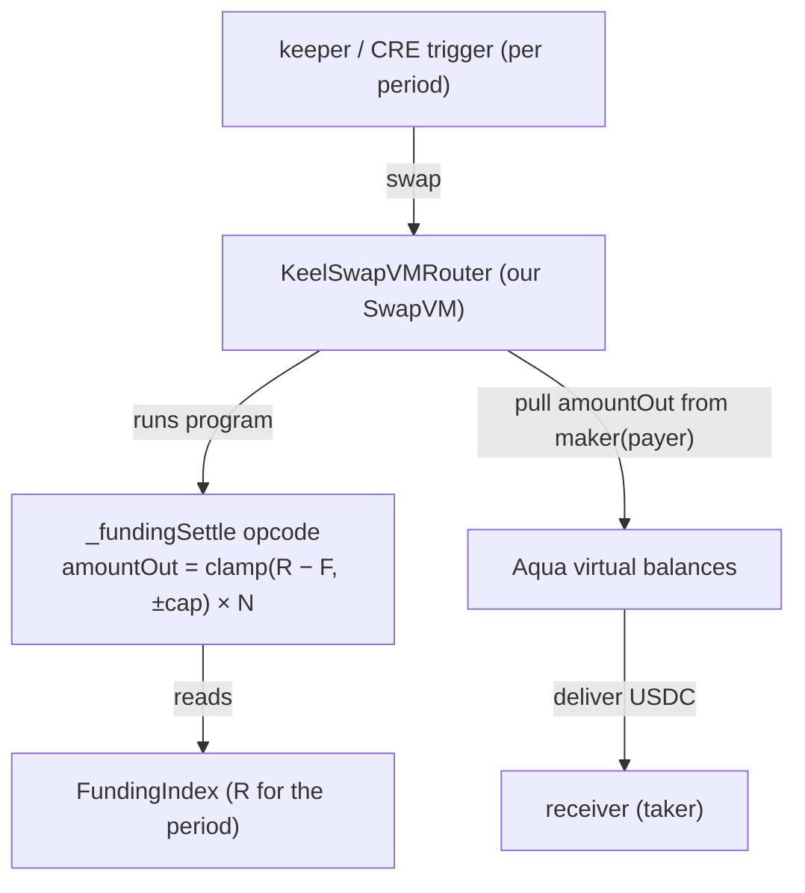
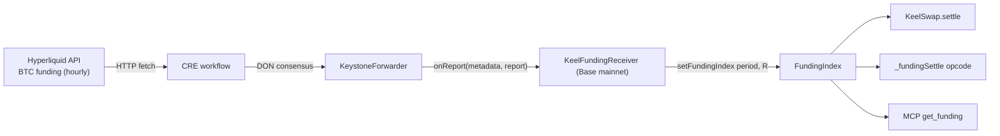
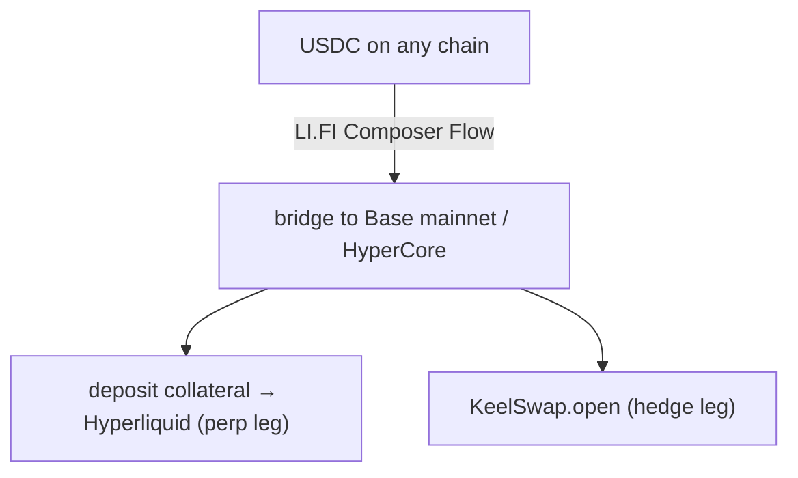

# Keel — Bounty Integrations

> How each sponsor tech is integrated, in detail — with diagrams and code. **The test every
> integration must pass:** *pull it out and the product breaks.*
> **Target bounties: 1inch · Chainlink · LI.FI.** Deploy chain: **Base mainnet.** Funding data
> source: **Hyperliquid** (read by CRE).

## Summary

| Bounty | Prize | Load-bearing? | Pull it → |
|---|---|---|---|
| **1inch — Build an Aqua App** | $5,000 | ✅ | no settlement venue / no Aqua-native swap |
| **Chainlink — Best workflow with CRE** | $6,000 | ✅ | no funding number → nothing to settle |
| **LI.FI — Composer** | $4,000 | ✅ | no one-click cross-chain way to fund + open the hedge |



---

## 1inch — Build an Aqua App ($5,000)

**What we build.** A custom **SwapVM instruction `_fundingSettle`** that turns a swap into one
period's funding settlement: it reads the latched funding rate, nets it against the locked fixed
rate, clamps to the per-period cap, and writes the result to the swap's output register, so the
router delivers `net` USDC from the payer (maker) to the receiver (taker). It is registered in our
own router (`KeelSwapVMRouter`, which extends `AquaOpcodes` and appends the opcode) and exercised via
a program built by `KeelFundingProgram`.



**The opcode** (`packages/contracts/src/swapvm/FundingSettle.sol`):

```solidity
function _fundingSettle(Context memory ctx, bytes calldata args) internal view {
    (address fundingIndex, int256 fixedRate, uint256 cap, uint256 notional, uint256 periodSeconds) =
        abi.decode(args, (address, int256, uint256, uint256, uint256));

    uint256 period = block.timestamp / periodSeconds;            // derived on-chain; program stays fixed
    (int256 realized, bool isSet) = IFundingIndex(fundingIndex).getFundingIndex(period);
    require(isSet, FundingNotSet());

    int256 diff = _clamp(realized - fixedRate, cap);             // clamp(R − F, ±cap)
    ctx.swap.amountOut = (_abs(diff) * notional) / RATE_ONE;     // net: maker(payer) → taker(receiver)
}
```

**Registering the opcode** (`KeelOpcodes.sol`) — appended at the end of the Aqua set so existing
indices are preserved; `ProgramBuilder.findOpcode` resolves it by function pointer:

```solidity
function _opcodes() internal pure override
    returns (function(Context memory, bytes calldata) internal[] memory result)
{
    function(Context memory, bytes calldata) internal[] memory base = AquaOpcodes._opcodes();
    result = new function(Context memory, bytes calldata) internal[](base.length + 1);
    for (uint256 i = 0; i < base.length; i++) result[i] = base[i];
    result[base.length] = _fundingSettle;
}
```

**Why it's load-bearing.** The swap *literally executes as our opcode* — Aqua/SwapVM is the
settlement engine, not a wrapper. A funding-rate swap is a novel "sophisticated DeFi position" (a
derivative), and "define your own instruction" is the invited use. Collateral stays alive via Aqua
virtual balances. **SwapVM is scored higher** — and we use it for real.

**Status / qualification.** Built; opcode unit-tested + a deploy-wiring test in the single Foundry
package. Settlement is one token, one direction (`tokenIn ≠ tokenOut` is enforced, so the hedge
position is the `tokenIn` with `amountIn = 0` via `allowZeroAmountIn`; USDC is `tokenOut`).
Qualification: onchain token transfer in the demo ✓ · incremental git history ✓ · SwapVM used ✓.

---

## Chainlink — Best workflow with CRE ($6,000, up to 3×$2k)

**What we build.** A CRE workflow that reads BTC funding from the **Hyperliquid API**, reaches DON
consensus, and writes it on-chain via the canonical consumer path — the KeystoneForwarder calls
`KeelFundingReceiver.onReport`, which decodes `(period, value)` and forwards to
`FundingIndex.setFundingIndex(period, value)`. There is no on-chain funding-rate oracle — without CRE
there is no number to settle against.



**The consumer** (`packages/contracts/src/KeelFundingReceiver.sol`) implements Chainlink's
`IReceiver` + ERC-165. The forwarder calls `onReport`, which decodes `(period, value)` from the
report and writes the latch; it is idempotent (skips an already-set period) and also accepts an
owner-rotatable EOA `relayer` as the live-demo fallback.

```solidity
function onReport(bytes calldata, bytes calldata report) external override {
    if (msg.sender != forwarder && msg.sender != relayer) revert NotAuthorized();
    (uint256 period, int256 value) = abi.decode(report, (uint256, int256));
    if (fundingIndex.isSet(period)) { emit ReportSkipped(period); return; }
    fundingIndex.setFundingIndex(period, value);
}
```

**The on-chain latch** (already shipped, `packages/contracts/src/FundingIndex.sol`) — the receiver is
wired in as its `forwarder`:

```solidity
function setFundingIndex(uint256 period, int256 value) external onlyForwarder {
    if (isSet[period]) revert AlreadySet(period);   // write-once per period
    _value[period] = value;
    isSet[period] = true;
    emit FundingIndexSet(period, value);
}
```

**Conventions (locked).**
- `value = R = AFR` (actual funding rate), **signed `int256`, scale `1e18`, PER-PERIOD** — funding can go negative.
- **Annualized → per-period conversion happens OFF-CHAIN, in the CRE workflow.** The contract never sees an annualized rate.
- `period = floor(unixSeconds / PERIOD_SECONDS)`, `PERIOD_SECONDS = 120` for the demo. Everyone (contract, keeper, UI, MCP) uses this exact formula.
- Set the latch's `onlyForwarder` to the `KeelFundingReceiver` (rotatable via `setForwarder`); the receiver in turn gates `onReport` to the CRE KeystoneForwarder (+ the relayer fallback).

**Hyperliquid funding source** (verify schema on the day):
- `POST https://api.hyperliquid-testnet.xyz/info`
  - current: `{"type":"metaAndAssetCtxs"}` → asset ctx includes `funding`
  - history: `{"type":"fundingHistory","coin":"BTC","startTime":<ms>}` → `[{coin, fundingRate, premium, time}]`
- HL `fundingRate` is hourly fractional (e.g. `"0.0000125"`); convert to per-period `1e18` signed in the workflow.

**Why it's load-bearing.** Canonical CRE shape: **external API → DON consensus → on-chain state
change** (`setFundingIndex`), not a UI reading a feed. The index is consumed by three parts of the
system — `KeelSwap`, the `_fundingSettle` opcode, and the MCP's `get_funding`.

**Qualification.** CRE workflow as orchestration layer ✓ · integrates a blockchain with an external
API (Hyperliquid) ✓ · a successful CRE CLI simulation qualifies (they deploy it live for you) — land
**≥1 real on-chain write** ✓ · makes an on-chain state change (not a UI read) ✓.

**Build steps (Axel).** (1) Base mainnet RPC + confirm CRE supports Base mainnet and its
KeystoneForwarder address; get the deployed `KeelFundingReceiver` + `FundingIndex` from
`deployments.json`. (2) Write the workflow: HTTP fetch HL BTC funding → DON consensus → convert
annualized→per-period → encode `(period, value)` → `writeReport` targeting the receiver. (3) Simulate
via CRE CLI. (4) Land one real on-chain write; hand the tx hash to the submission.

**Fallback.** If the DON is flaky by the checkpoint, the authorized **EOA relayer** calls
`KeelFundingReceiver.onReport` with the real API-derived per-period index for the live loop — same
code path, no contract change — but keep ≥1 real CRE write for the bounty.

---

## LI.FI — Composer ($4,000)

**What we build.** One-click dual-leg onboarding: a LI.FI Composer Flow bridges the user's USDC from
any chain and, in the same flow, (a) deposits collateral into Hyperliquid (HyperCore) for the perp
leg and (b) opens the Keel swap (`KeelSwap.open`). The MCP uses Composer as its execution layer
(Agentic Workflows track). *(Section owned by the integration lead; design-doc §6 has the flow.)*



**Why it's load-bearing.** A hedger's capital is rarely already on the settlement chain; without
LI.FI, funding the hedge is a manual multi-step bridge. Composer makes "fund + open both legs" a
single confirmation. **Open item (integration lead):** confirm a single Flow can chain an arbitrary
`KeelSwap.open` call alongside the HL deposit; else two sequenced calls behind one MCP confirmation.

---

## Honesty rules (say these on stage)

- **Never claim "first"** — Rho is live (see design-doc §12). We compete on Aqua-native execution +
  live collateral + the Ethena demo.
- **Real vs scripted:** the lock + USDC settlements are real (Base mainnet); the Ethena crash is a
  *replay* of real historical funding on a slider.
