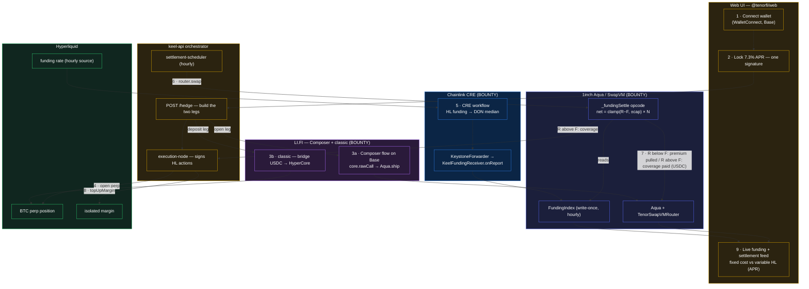

# TenorFi — Demo Flow & Bounty Integration

> One picture of the end-to-end demo and where each bounty is load-bearing.
> Settlement is **hourly** (matches Hyperliquid funding + the CRE write).

## Flowchart

## The beats (what the audience sees)

| # | Beat | Component |
|---|------|-----------|
| 1–2 | Connect wallet, **Lock 7.3% APR** in one signature | Web UI + WalletConnect |
| 3a | **Composer** flow opens the subscription on Base — `core.rawCall`s Aqua's `ship` | **LI.FI Composer** → **1inch Aqua** |
| 3b | **classic** bridges USDC to HyperCore (Composer can't reach non-EVM HyperCore) | **LI.FI classic** |
| 4 | execution-node opens the BTC perp | Hyperliquid |
| 5 | **CRE** writes BTC funding hourly → `FundingIndex` on Base | **Chainlink CRE** |
| 6 | settlement-scheduler fires `router.swap` each hour | keel-api → **1inch SwapVM** |
| 7 | `_fundingSettle` settles: **R>F** reserve covers (paid out) / **R<F** premium pulled — real USDC | **1inch Aqua** |
| 8 | On coverage, the payout **tops up the subscriber's HL margin** (hedge stays funded) | keel-api → Hyperliquid |
| 9 | UI shows variable HL funding smoothed to a **flat fixed cost** | Web UI |

## Bounty integration — all three are load-bearing

| Bounty | Role in the flow | Where |
|--------|------------------|-------|
| **1inch — Build an Aqua App** | The settlement engine: a custom `_fundingSettle` SwapVM opcode on our own router settles fixed-vs-floating each period over Aqua, zero subscriber collateral. Composer's `rawCall` also opens the position *through* Aqua. | `packages/contracts/src/swapvm` |
| **Chainlink — CRE** | The funding-rate oracle that doesn't otherwise exist: reads Hyperliquid funding, DON consensus, writes the on-chain `FundingIndex` the opcode reads. Without it nothing can settle. | `packages/cre/keel-funding` |
| **LI.FI — Composer** | One-signature onboarding. **Composer** builds the Base leg that interacts with our Aqua contract (`core.rawCall → ship`); **classic** handles the HyperCore bridge. The split is deliberate — Composer can't reach non-EVM HyperCore. | `packages/lifi` (`open.ts` Composer · `classic/`) |

Pull any one and the product breaks: **CRE** brings the number, **Aqua** settles it, **LI.FI** brings the capital and opens the position. Hyperliquid is the funding source + the perp venue (not a bounty target).
