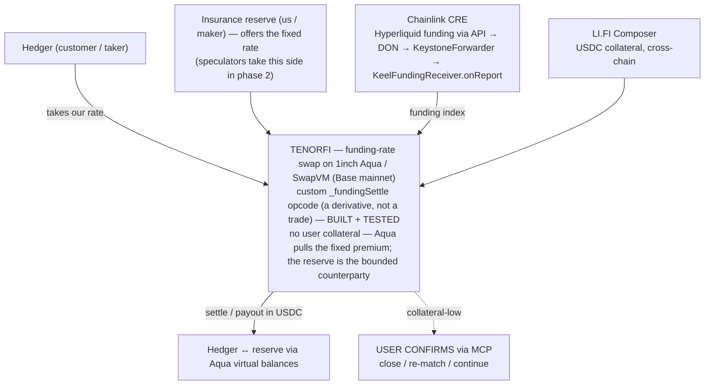
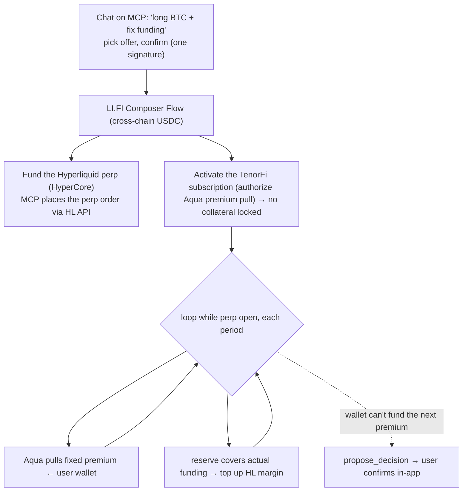

# TenorFi — Design Doc (ETHGlobal New York 2026)
*(on-chain fixed-funding-rate swaps — the interest-rate swap for perps. A *tenor* is the term of a swap.)*

> **TenorFi is the interest-rate swap for perp funding — variable to fixed, in one click, with zero collateral (a fixed premium is pulled from your wallet as you go).** Perp funding swings wildly and **no risk desk can hold an open-ended variable cost** — which is why institutions can't touch perps. TradFi solved the identical problem with the fixed-for-floating interest-rate swap; TenorFi is that swap for perps. The invisible cost that gutted Ethena — and that keeps institutions out — made fixed.

**Status:** problem validated (real, famous, recent). ⚠️ **NOT a new category — funding-rate swaps already exist (Strips, Rho, IPOR).** Our claim is *execution*, not *first*: an **Aqua-native** swap with **zero user collateral**, a **custom SwapVM settlement opcode**, and pure matching. EVM/Solidity, **a deterministic core an agent can *operate* but not *override*** — an MCP lets an agent drive the swap, but the brink decision is a human checkpoint (*agent proposes, user confirms* — see §5–§6). Bounties: **1inch Aqua · Chainlink CRE · LI.FI.** Funding is read from **Hyperliquid**; the swap is deployed on **Base mainnet**.

> ⚠️ **Design direction (current) — read with [`flows.md`](flows.md), which is canonical for the flow.**
> TenorFi is moving to a **subscription / just-in-time-premium** model: the user posts **no collateral**,
> 1inch Aqua pulls a **fixed premium** from their wallet each hour, and TenorFi **covers their actual
> funding** on Hyperliquid. The product-level framing in §4–§6 below reflects this. The **deployed** Base
> contracts still implement the *prior* model — **net** `(R − F)` settlement from **pre-shipped Aqua
> virtual balances**, TenorFi never touching HL — so the on-chain spec in §6 (*Settlement math*, the
> addresses, the 38 tests) describes what's live **today**; the subscription split is the active
> migration. Don't present it as fully on-chain until the contracts ship.

---

## 1. The problem
**Funding rate = the floating fee perpetual-futures traders pay or earn, every hour.** It changes constantly — one month you earn 50% APR, the next you pay. Millions of traders, market-makers, and "delta-neutral" funds live on it, and **nobody can lock it in.**

**And it's why institutions can't enter perps.** Perps did ~$60T+ of volume in 2025, but the largest pools of capital can't touch them: an open-ended *variable* funding cost is uninvestable — no risk committee signs off on a carry that can spike 10× in a day and isn't hedgeable. The exposure isn't the blocker; the *unhedgeable variable cost* is.

**Ethena is the famous corpse.** Its whole strategy was *collecting* funding. At its peak it held **~$16.6B** (Sept 2025). When funding cooled, USDe's yield compressed to **5.1%** — *below* Aave's 5.4% borrow cost — the leveraged loop lost its reason to exist, and capital fled: down to **~$5.6B** today (a ~$8–11B bleed). No hack, no theft — *the safest "sleep at night" strategy in crypto was the one that lost the most,* because its income was variable and it couldn't lock it.
*(Honest framing: that's capital **redeeming** as the funding-driven yield collapsed — not trading losses; funding was the core driver alongside the broader Oct-2025 liquidation event.)*

---

## 2. Why it's painful (and timely)
**TradFi has run this exact movie before — and the fix built the largest market on earth.** In 1981, Volcker took rates to ~20% and the U.S. savings institutions collapsed: they earned a *fixed* rate (long mortgages) and paid a *variable* one (short deposits); when the variable cost outran the fixed yield, **over a thousand of them went insolvent** — death by a variable rate nobody could lock. TradFi's answer was the **fixed-for-floating interest-rate swap** (first swap 1981, fixed-for-floating ~1982–85). Once the risk was hedgeable, the instrument became *investable at institutional scale* → **~$469T notional outstanding today** (BIS/ISDA, mid-2024), one of the largest markets on earth. **The swap is literally what made a variable-rate world investable for institutions.**

**Oct 10, 2025 is the Volcker shock of perps**, and crypto is stuck pre-1981. Perps did **~$60T+ of volume in 2025** — the risk is built at scale — but the funding-swap layer is **thin and unproven**: the lending-rate generation (Strips, Voltz, IPOR) **died or pivoted away**, and the one live institutional player (**Rho**) **locks collateral and isn't built on shared liquidity.** The safety net is still nascent — and **nobody has framed it as the institutional on-ramp to perps, made Aqua-native with zero user collateral (a premium pulled as you go).**

---

## 3. How we validated it — and the hard truth
- **Problem is real + data-backed.** Ethena: ~$16.6B → ~$5.6B on yield compression ([The Block](https://www.theblock.co/post/380210/)). Funding swings violent (Mar-2020 +0.01% → −0.375% in days). ✅
- **⚠️ The instrument ALREADY EXISTS on-chain — this is NOT a new category.** A careful recheck found:
  - **Strips Finance** — *perpetual interest-rate / funding swaps*; users **lock fixed rates** off an exchange's floating funding. The exact instrument (now largely inactive — RabbitX pivoted to a perp DEX).
  - **Rho Protocol** — *funding-rate futures*: *"hedge perp funding-rate fluctuations — for the first time in crypto — higher capital efficiency, far less collateral."* That's the **full pitch, incl. the capital-efficiency wedge, already claimed.**
  - **IPOR** — fixed-rate IRS hedging (lending rates), capital-efficiency framed.
  - **HedgX** (ETHGlobal) — trades funding (speculation).
- **So the honest claim is *execution*, not *category*.** The defensible differentiator is narrow: an **Aqua-native** funding swap with **zero user collateral** — Aqua pulls a small **fixed premium** from the user's wallet each hour, just-in-time, so nothing is locked (Strips/IPOR lock margin dead for weeks) + a **custom SwapVM settlement opcode** + pure matching. Even "capital-efficient" is contested by Rho, so lean on the *specific* Aqua mechanic: **you post no collateral — you pay as you go.**
- **Bottom line:** TenorFi competes on **Technicality + bounty-fit + the Ethena demo — not on Originality.** Don't say "first." Say *"the funding swap, rebuilt natively on Aqua, where you lock up no collateral — a fixed premium is pulled from your wallet as you go."*

- **Validated with numbers** (Monte Carlo, `/tmp/keel_sim.py`): on a $1M position over 30d, *unlocked* funding income swings **~40% (p5→p95)** even in a normal regime; **locking → std $0** (a single flat number). Ethena-style crash (45%→4% APR): unlocked $3,021 vs **locked $16,438 → +$13,417**. No-default checks out: max hourly owed *at the cap* = **$411**, pre-locked per party, hourly settle covers it. Fair fixed ≈ **E[funding]** (protocol takes no directional bet). *(Model is illustrative — use real Hyperliquid funding for the demo replay; collateral required = cap × notional, so pick hourly settle + a sane cap.)*

---

## 4. The solution

### The core insight (read this first — it's the part everyone gets confused on)
**You pay a fixed premium; TenorFi covers your funding.** Each hour, TenorFi **covers the variable funding** you owe on your Hyperliquid perp, and in return pulls a **fixed premium** from your wallet — via 1inch Aqua, just-in-time. **You post no collateral**: nothing is locked, the premium is pulled only when due. TenorFi reads the funding rate on-chain (via Chainlink CRE) to know exactly how much to cover; it doesn't need to run a perp DEX, only to cover the fee. *(The MCP agent routes the coverage to your Hyperliquid margin on your behalf — see §6.)*

> **Insurance analogy.** Like health insurance: you pay a fixed premium, and the insurer covers the variable bill. TenorFi covers your variable funding for a fixed price, measured on-chain by Chainlink. **This is why we don't need to build our own perp DEX.**

**Your cost cancels to the fixed rate.** Whatever funding turns out to be, TenorFi absorbs it and you pay only the premium:

```
Funding owed on Hyperliquid:   − variable funding
TenorFi covers it:                + variable funding
You pay TenorFi (premium):        − fixed
                               ─────────────────────────────
Net:                           − fixed   (constant, hedged)
```

### The instrument & who's who
**A funding-rate swap: variable → fixed, in one click.** You don't change the market's funding — you lock *yours*, like switching a variable mortgage to a fixed one. Three roles, but only **two are live in the MVP**:

- **Hedger = the perp trader = the customer (the *taker*).** Holds a leveraged long on Hyperliquid, pays funding, hates the swings. On TenorFi they **pay a fixed premium and TenorFi covers their funding** → their variable cost is cancelled, leaving a flat locked rate. **They post no collateral** — the premium is pulled from their wallet as it comes due. They **take** a rate we offer, one click. The primary customer and the protagonist (the Ethena character).
- **Insurance reserve = us = the rate-offerer (the *maker*).** We post **consistent fixed-rate offers** and stand as the counterparty, so a hedger can lock **instantly** without waiting for anyone to show up. We **collect the fixed premium and cover the actual funding** — so we earn the spread when funding stays below the locked rate and pay out (bounded per period by the cap) when it spikes. The *certainty-seller*. *(Mechanically this is an LP/market-maker position; we frame it to users as the insurer.)*
- **Speculator (*Volátil*) — deferred to phase 2, NOT built.** In the mature market, people who want to bet on funding take the reserve's side and the reserve only fills the gaps. **For now, we ARE the counterparty.**

> **Leg direction (canonical, from the tested `_fundingSettle` opcode):** the hedger's net per period = `(realized − fixed) × notional` — they gain when funding is **high**, which offsets the high funding they pay on Hyperliquid. The reserve is the exact mirror, `(fixed − realized) × notional` — gains when funding is **low**. *(Earlier drafts mislabeled both sides as "receives floating" — that was a bug; this is the correct, tested convention.)*

**Cold-start is the real problem this solves.** A swap needs a counterparty, and at any moment there may be none. By making our **insurance reserve the always-on rate-offerer**, a hedger gets certainty on day one — the missing piece that turns the idea into a working product.

### Why leverage matters (the customer story)
Funding is charged on **notional** but drains your **margin**. With leverage `L`, notional = margin × L, so:

```
% of margin consumed by funding = funding_rate × time × L
```

The margin cancels, leaving `L` as a multiplier. A funding spike that's a nuisance at 1× is a **liquidation at 10×**. The funding rate is the same for everyone regardless of leverage — leverage amplifies the *damage to margin*, not the rate. So the **leveraged long is the customer who needs this most**, and whom the swap protects most.
- **The protocol itself stays neutral** — the TenorFi *contract* only custodies collateral and settles; it holds no position. The *liquidity* comes from our **insurance reserve** (bounded by the per-period cap + pre-locked collateral), exactly as an exchange is neutral while market-makers provide the quotes. In the demo we run that reserve; in production it's multiple reserve providers + speculators.

**The core is deterministic — no AI in the settlement math, so no hallucination risk where money moves.** An optional agent layer (our MCP, §6) can *operate* the swap, but it cannot *override* the one decision that matters: the collateral-low call is a **human checkpoint** — the agent proposes, the user confirms. **Agent proposes, user confirms.**

---

## 5. The mechanism (the core)
- **The subscription.** Each hour, Aqua **pulls the fixed premium** from the user's wallet (just-in-time) and the reserve **covers the user's actual funding**. The user posts no collateral; their perp funding is absorbed by the reserve → **net funding = the fixed rate. Locked.**
- **Pricing & liquidity (the RFQ model).** Our **insurance reserve quotes a consistent fixed rate** (≈ expected funding + a small maker spread). A hedger **takes** that offer one-click — no waiting for a matching speculator — and confirms it in-app. Because we're the standing counterparty, liquidity is **instant**. *(Phase 2: when real speculators exist, matched hedger/speculator flow nets peer-to-peer via Aqua virtual balances — the Aqua0 thesis, matched flow needs ~no capital — and the reserve only covers the residual.)*
- **Why it survives a black swan — three locks:**
  1. **The reserve's risk is bounded.** Our **insurance reserve** is the counterparty and *does* take directional risk, but it is **bounded**: per period it can never owe more than `cap × notional`, and the reserve is pre-funded to cover that max.
  2. **Hourly settlement** — debt never accumulates; exposure resets every hour.
  3. **Funding is capped per hour (venue clamp) + the reserve is pre-funded to cover that max** → *the most the reserve can owe in an hour is already funded → no default.* The user holds nothing to lose: if their wallet can't fund the next premium pull, **only their position closes** — there is no user collateral to drain.
- **Honest residual risks (say them):** as the **insurance reserve we take bounded directional risk** (capped per period, not zero — we earn when funding stays calm, pay when it spikes) — Voltz-style; **oracle staleness under congestion**; **correlated reserve assets.** Owning these makes you more credible.
- **Worked example.** Lock **7.3% APR**. Real funding → **50%**: you still pay 7.3% (the reserve covers the 50% funding). Real funding → **0%**: you still pay 7.3% (the reserve keeps the spread). Either way, **your rate didn't move — and you locked up nothing.**

### The brink decision (the second core feature)
If the user's wallet can no longer fund the next premium pull, TenorFi does **NOT** close blindly. It surfaces a **human decision point** — the MCP agent prepares it, the user confirms. Three options are presented:
1. **Close** the position and settle now,
2. **Re-match** — find a new counterparty / re-quote,
3. **Continue** — top up the wallet and ride it out.

This is the human-in-the-loop checkpoint: **the agent proposes, but the decision that moves money at the brink is confirmed by a person.** (The agent detects that the wallet can't cover the next premium and the user's confirmation gates which of the three branches executes.)

---

## 6. Architecture (Aqua at the center)
**The 3-layer stack:** **Chainlink CRE** (the funding-rate oracle — the funding TenorFi must cover) → **1inch Aqua / SwapVM** (pulls the fixed premium from the user's wallet just-in-time each period; the reserve covers the funding — no user collateral) → **LI.FI Composer** (one-click onboarding — bundles cross-chain USDC to fund the perp + authorize the subscription into a single Flow; detailed in the LI.FI section).

**The full flow:** Chainlink CRE reads BTC's real funding rate from **Hyperliquid** each period → writes it on-chain as a **funding index** → the swap contract on **1inch Aqua** reads that index, computes fixed-vs-floating, and transfers the difference between the two parties → settlement and payout in **USDC**. **The swap is deployed on Base mainnet** (CRE and LI.FI support it, and we deploy our own Aqua + router there); **Hyperliquid is the funding-rate data source.**



**1inch Aqua — the core; the whole instrument lives here.** Three things only Aqua makes possible:
- **Zero collateral — premium pulled as you go.** Strips/IPOR lock margin dead for weeks; with Aqua, the user posts **nothing** — Aqua **pulls the fixed premium from their wallet just-in-time** each period, only when due. For a multi-week hedge, that's *no capital locked at all* vs. weeks of dead margin. *(This is our one real edge vs. Rho/Strips — protect it.)*
- **A custom SwapVM opcode for periodic settlement.** Not a spot swap — a dedicated settlement instruction that reads the funding index and nets fixed-vs-floating each period, on-chain. A new use of SwapVM: **a derivative, not a trade.**
- **The matching/custody layer.** Aqua holds both sides and enforces the swap without the *protocol* ever taking a house position — it just matches and settles. *(Honest caveat: matched flow nets to zero; when the book is one-sided, the insurance reserve absorbs the residual as a **bounded** counterparty — not zero-risk, but capped.)*

*Pitch to 1inch:* "We didn't bolt Aqua onto a swap — we built a **periodic-settlement derivative inside SwapVM**, where the user posts no collateral and Aqua pulls the premium from their wallet as you go. Aqua doing something it was never shown doing before."

**Chainlink CRE — the oracle that doesn't exist.** There's no on-chain funding-rate oracle. CRE fetches Hyperliquid funding via API, reaches DON consensus, writes it on-chain. Without CRE there's nothing to swap.
**LI.FI Composer — one-click dual-leg onboarding.** The hedge only works if **both legs open together**: a Hyperliquid perp *and* the TenorFi swap. LI.FI Composer makes that one signature — the user signs once and Composer orchestrates the whole onboarding as a single bundled **Flow**: it (a) **brings the user's USDC from any chain**, (b) **deposits collateral into Hyperliquid** (the perp leg) and (c) **opens the swap position in our protocol** (the TenorFi leg) — all in one transaction.
- **Accuracy caveat (don't overclaim):** LI.FI's documented Hyperliquid integration **deposits collateral into Hyperliquid** ("step into HyperCore in one step") — it does **not** itself place the leveraged perp order. So LI.FI's precise role is *"orchestrates cross-chain onboarding + deposits into both legs in one Flow"*; the **actual perp order is fired via the Hyperliquid API within the same flow** (driven by the MCP — see the agent layer). Do not say "LI.FI opens the perp."
- **Precedent:** a prior LI.FI hackathon winner (**Magnolia**) did 1-click delta-neutral funding positions across Hyperliquid using LI.FI — the same one-signature, dual-venue pattern.

> *Pitch:* "The hedge only works if both legs open together — **LI.FI Composer bundles the perp-leg deposit and the swap position into one click.** Without it, the user assembles the hedge by hand across two venues."

**One line each:** **Aqua = the engine** (pulls the fixed premium as you go, zero collateral) · **CRE = the thermometer** (measures funding, puts it on-chain) · **LI.FI = the on-ramp** (one click brings USDC cross-chain to fund the perp + start the subscription). *Pull any one and the product breaks — but Aqua is the one we push furthest.* Settlement currency is **USDC on Base mainnet**.

### The agent layer (MCP) — the one-click front door (agent proposes, human disposes)
The **TenorFi MCP** is how a user enters in one conversation. The agent orchestrates **both legs** of the hedge on the user's behalf; the user confirms with a single in-app signature.

**The conversation (illustrative):**
> **User:** "Create a long on BTC on Hyperliquid and fix the funding rate."
> **MCP:** "Your fixed rate is **7.3% APR** — the fair rate, from a year of real BTC funding. Coverage auto-scales to **1.5% of your position** (for a $5k long, $75, pre-funded by the reserve). Confirm to open."
> **User:** "Confirm."
> **MCP:** "Done — sign once."

TenorFi quotes **one fixed rate, 7.3% APR** (the fair/break-even rate, not a menu of tiers), with a `max coverage` that **auto-scales with the position**. **Coverage = the reserve's pre-locked collateral (`speculatorCollateral`)** — the *cumulative* budget it can pay the user over the swap's life, sized **≈ 1.5% of the notional** (validated against a year of real BTC funding, `docs/research/analysis.md`). It is **not** `cap × notional` — that is only the per-period clamp. *(Fixed tiers like $25k/$50k/$100k would imply ~$2M/$5M/$15M of notional; the small-notional demo auto-scales instead.)* The user **confirms to open** (a single in-app signature).

**Two legs, one click (via LI.FI Composer).** On that single signature, a **LI.FI Composer Flow** brings the user's USDC from any chain and deposits collateral into **both** legs in one transaction; the MCP fires the actual perp order via API inside the same flow:
1. **The Hyperliquid perp** — Composer **deposits the collateral into Hyperliquid** ("step into HyperCore in one step"); the **MCP places the leveraged long via the Hyperliquid testnet API** within the same flow. *(LI.FI deposits, it does **not** place the order. The MCP acts on the user's behalf; the TenorFi **contract** never touches Hyperliquid — see §4 core insight.)*
2. **The TenorFi position** — the same Composer Flow opens the fixed-rate swap against the insurance reserve by **shipping both legs into Aqua** (the reserve and hedger each `ship` a strategy built by `KeelFundingProgram`, settled by `KeelSwapVMRouter`). The user's collateral backs the swap as an Aqua **virtual balance** — it stays live in their wallet rather than being custodied.

**The settlement loop (each period, while the perp is open).** Let `AFR` = Actual Funding Rate (realized, from CRE) and `FFR` = Fixed Funding Rate (the locked rate). Each period, two flows:
- **Premium in:** Aqua **pulls the fixed premium** (`FFR × notional`) from the user's wallet, just-in-time.
- **Funding covered:** the reserve **covers the actual funding** (`AFR × notional`, capped) and the MCP routes it into the Hyperliquid position's margin (tops it up — the hedge in action).

So when **`AFR > FFR`** the reserve eats the gap, and when **`AFR < FFR`** the reserve keeps the spread — either way the user pays the fixed premium and nothing else. This is the §4 cancellation made real: the coverage refills exactly the margin that funding drains, so the user's **net funding cost stays pinned at the fixed rate**, with **no collateral locked.**



**Tool surface:**
- **Read:** `get_funding(market)` (AFR via CRE), `list_offers()` (the reserve's fixed-rate offers), `get_position(addr)`, `preview_settle(swapId, realized)`.
- **Open (user-signed):** `open_hyperliquid_position(market, side, size)` (HL testnet API) + `open_keel_position(offerId)` (approve Aqua + `ship` the leg into Aqua via `KeelFundingProgram`/`KeelSwapVMRouter`).
- **Settle (routine, keeper/agent):** `settle(orderHash, period)` → the bound taker calls `KeelSwapVMRouter.swap` over the shipped order, moving the netted USDC; on `AFR > FFR`, `topup_hyperliquid_margin(...)`.
- **Gated (brink, user-confirmed):** `propose_decision(swapId)` → the *unsigned* close / top-up / re-match tx for the user to confirm.

**Honesty stays honest:** the TenorFi *contract* computes the cashflow **deterministically** from the on-chain funding number (`R`) and pulls/pays USDC; the *MCP* is the convenience layer that drives the user's HL leg via API and **routes the funding coverage to their HL margin**. There's no AI in the settlement math (no hallucination where money moves); the agent builds the txs, the **user confirms.** *Agent proposes, user confirms.*

### Feasibility against the bounty stack (verified this session)
- **1inch Aqua / SwapVM** — ✅ **BUILT + TESTED + AUDITED + DEPLOYED** (`packages/contracts/src/swapvm`). A custom `_fundingSettle` SwapVM instruction (`amountOut = clamp(R−F,±cap)×N`) registered in our own router (`KeelSwapVMRouter`); virtual balances keep collateral in-wallet. Unit-tested + an **e2e where a settlement executes through the opcode and moves real USDC via Aqua**, with a **double-settle guard** (per order+period), a **no-default test** (ship-floor covers the worst-case period; an underfunded period reverts rather than creating unbacked debt), a **two-leg mirror test** (ship both orders; settle the R<F hedger-pays-reserve leg end-to-end on real Aqua), plus a deploy-wiring test — 38 tests in the single Foundry env (incl. a Base-mainnet fork that moves real USDC) — plus a Slither pass and an adversarial (pashov) audit (`docs/security-review.md`). **Deployed + Basescan-verified on Base mainnet** (router `0x3a526bdb3249512580760A703248c3E0700766E9`, program `0x5A6f0876EDe0797ee126a32a616875862BfcF6EB`, position token `0x6514B382a2a5BaeAF5c17ab6A02c5A1fB511FfB9`), reusing the live CRE funding stack. Each period is one atomic, keeper/CRE-triggered swap; recurrence is external.
- **Chainlink CRE** — verified (chainlink-cre-skill / docs): HTTP/Confidential-HTTP → DON consensus → KeystoneForwarder → `KeelFundingReceiver.onReport` (canonical `IReceiver` consumer) → on-chain write. Reading Hyperliquid funding via API and posting an index is squarely in scope. ✓
- **Base mainnet** (chain id 8453) — the deploy target for the swap (Aqua, CRE, and LI.FI all support it; EIP-1153 transient storage is available, so the SwapVM opcode runs). ⚠️ Real funds/gas — keep position sizes small for the live test. CRE confirmed on Base mainnet: chain name `ethereum-mainnet-base-1`, selector `15971525489660198786`, production KeystoneForwarder `0xF8344CFd5c43616a4366C34E3EEE75af79a74482` (simulation MockForwarder `0x5e342a8438b4f5d39e72875fcee6f76b39cce548`). Settlement token = **canonical Base USDC** `0x833589fCD6eDb6E08f4c7C32D4f71b54bdA02913` (real USDC — the path the Base-mainnet fork test exercises). *(A `MockUSDC` was deployed early at `0x3A51…c6e8`; it is **superseded/unused** — settlement is real USDC.)* **Hyperliquid** is the funding-rate data source (read via API by CRE), not a deploy target.
- **LI.FI Composer** — one-click dual-leg onboarding: cross-chain USDC → deposit into Hyperliquid (HyperCore) **+** open the TenorFi swap in one Flow. The Hyperliquid deposit step is documented ("step into HyperCore in one step"); the Magnolia hackathon winner is precedent for the 1-click delta-neutral pattern. **TODO (integration lead):** confirm Composer can chain an **arbitrary contract call (the Aqua `ship` that opens the TenorFi leg) into the same Flow as the HL deposit** — if a single Flow can't bundle both, fall back to two sequenced calls behind one MCP confirmation. The perp order itself is fired via the **Hyperliquid API** by the MCP inside the flow (LI.FI deposits collateral; it does not place the order).

### The opcode + MVP scope
**The whole on-chain core = one custom opcode + one oracle-write + two swaps:**
- **`_fundingSettle(Context, bytes)`** — the one custom SwapVM instruction: reads the latched funding index + swap terms (fixed rate, notional, parties), computes the net cashflow `(realized − fixed) × notional` (capped at the hourly clamp), and `pull()/push()`es it from payer → receiver. Marks the period settled (no double-settle).
- **`setFundingIndex(period, value)`** — storage latch (`onlyForwarder`). The CRE KeystoneForwarder calls `onReport` on **`KeelFundingReceiver`**, which decodes `(period, value)` and writes the latch; the receiver is wired in as the `forwarder`.
- **Open / close** = each side `ship`s its strategy into Aqua (collateral as a virtual balance + a position-marker token as the swap's `tokenIn`); close = stop shipping / withdraw the remaining virtual balance. No collateral is custodied by a TenorFi contract on this path.
- **MVP scope:** one swap between a **hedger (customer/taker)** and **the insurance reserve (maker/counterparty)** + the CRE index + a keeper firing settlement each period. The hedger takes our offered fixed rate via the MCP and confirms in-app. **That alone demos the thesis.**
- **One engine — Aqua-only (LOCKED).** All settlement runs through the `_fundingSettle` SwapVM opcode over Aqua — that is both the 1inch bounty *and* the only path that delivers the headline edge (*collateral stays live as a virtual balance, never custodied*). There is **no custodial settlement contract**: each side `ship`s its own collateral as an Aqua virtual balance, and the opcode nets fixed-vs-floating against it. Because a funding swap is two-sided but SwapVM is one-directional, each position is **two shipped orders** (reserve-pays-above + the hedger-pays-below mirror). The **no-default guarantee** is enforced the Aqua way: ship ≥ `cap × notional`, the opcode caps each period's payout at `cap × notional`, and Aqua can never push tokens a maker didn't ship — so no side is ever overdrawn (a settlement that would exceed the shipped balance reverts instead of creating unbacked debt). **Speculators are phase 2.** *(SwapVM has no native scheduling → the settle is keeper/CRE-triggered each period.)*

### Settlement math (formal spec — pinned by the tested `_fundingSettle` opcode, source of truth: 38 tests green)

> ⚠️ **This section documents what's DEPLOYED today (the net model), not the subscription framing in §4–§5.**
> The live opcode settles the **net** `clamp(R − F, ±cap) × notional` from **pre-shipped Aqua virtual
> balances** (the user ships a balance; TenorFi never touches HL). The subscription model — user posts
> nothing, Aqua pulls only the fixed premium, the reserve covers the funding — is the **migration**;
> economically the per-period net is identical, so this spec stays valid until the split ships.

**The tested `_fundingSettle` opcode is canonical.** Where any earlier draft disagrees with the contract, the contract wins. The three decisions below are **LOCKED** (no longer open).

**Variables (and their on-chain scale):**
- `N` = notional, **USDC `1e6`**.
- `F` = fixed rate, **per-period, signed `1e18`**.
- `R` = realized floating rate for the period (from CRE), **per-period, signed `1e18`**.
- `cap` = max `|R − F|` per period (the Hyperliquid hourly funding clamp) = **`0.04` per period → `4e16`**.
- `period` = `floor(block.timestamp / periodSeconds)` — a **fixed-width settlement window** (demo `periodSeconds = 120`). The opcode settles a window **once**, at its per-period rate; there is no on-chain elapsed-time term. The window's real-time funding is folded into `R` off-chain by CRE (LOCKED #2), so the on-chain math is pure per-period.

- **Per-period net cashflow:** `payment = N × clamp(R − F, ±cap)` (the **credit to the hedger**). Equivalently, the hedger's *outflow* is `N × (F − R)`.
  - **Direction (canonical, from the tested contract):** `net = realized − fixed`. `R > F` → **hedger is credited, the reserve (counterparty) pays**; `R < F` → **hedger pays, the reserve is credited**. (In the opcode each leg is one shipped order: the **maker** is the payer and the **bound taker** is the receiver — in the MVP the reserve and the hedger.) ⚠️ An earlier draft wrote *"F > R → Hedger receives,"* which is **wrong** — it inverts the leg. The shipped contract uses `net = realized − fixed` (hedger = floating receiver), and that is the source of truth.
- **No-default bound:** `maxPeriodAmount = cap × N` — the most that can move in one period. Each side ships at least this as its Aqua virtual balance (`collateral_min ≥ cap × N`; size to `cap × N × periods_buffered` for a multi-period buffer). **Enforced by consequence, not at ship time:** on the Aqua path nothing forces a maker to ship the floor — but a settlement that would exceed the shipped virtual balance simply reverts (Aqua cannot push tokens that were never shipped), so an under-shipped position can only fail to settle, never create unbacked debt (`test_noDefault_shipFloorCoversWorstCase_underfundedPeriodReverts`).
- **Close trigger (→ user confirmation):** close/decide when `remaining_collateral < cap × N` (can't cover one more worst-case period).
- **Position-marker token + maturity:** SwapVM requires `tokenIn ≠ tokenOut`, so each leg's `tokenIn` is a non-USDC **position-marker ERC20** (amountIn 0; `allowZeroAmountIn`), `tokenOut` is USDC. The shipped order carries **no on-chain expiry** — "close at maturity" is off-chain: stop settling further windows and withdraw the remaining Aqua virtual balance.
- **Final PnL per side:** `Σ over settled periods of N × clamp(R_i − F, ±cap)` (sign per side).
- **Fair fixed rate (advanced):** `F ≈ E[R]` over the tenor, so the swap is zero-expected-value at inception (protocol takes no directional bet).

⚠️ **Unit-consistency invariant (enforced in `FundingSettle`):** `R`, `F`, and `cap` **MUST share the same per-period `1e18` scale at the clamp site.** If `cap` (`4e16`) is compared against an `R − F` expressed in any other scale, the clamp **never bites** and the no-default bound silently breaks. This is the single most important thing to confirm in the contract's settlement path.

**Three LOCKED decisions:**
1. **Discrete per-period accumulator — LOCKED (not cumulative).** Settlement is **discrete per period**: a keeper fires `settle()` each period and every period is settled in order. We do **not** use an IPOR-style cumulative funding index (`cumIndex`). The cumulative-index path (realized between two timestamps = `cumIndex_B − cumIndex_A`, enabling lazy/range settlement) is **roadmap**, post-hackathon — not built.
2. **Annualized→per-period conversion happens OFF-CHAIN — LOCKED.** The UI quotes annualized rates, but **CRE/edge code converts to per-period before anything reaches the chain.** The contract receives `R` and `F` **already per-period (signed `1e18`)** and never sees an annualized rate. On-chain math is pure per-period.
3. **Discrete fixed-window period — LOCKED.** The shipped `_fundingSettle` opcode derives `period = floor(block.timestamp / periodSeconds)` and settles each window **exactly once** at its per-period rate `R` — there is **no on-chain `Δt`, no `last_settlement`, no elapsed-time multiplier** (the payment formula above has no `Δt` term). Real-time funding is converted into the per-period `R` off-chain by CRE before it reaches the chain. The demo compresses wall-clock time by using a small `periodSeconds`; the numbers reconcile because each window settles its own latched `R`. *(An elapsed-time / cumulative-index model — settling an arbitrary `[t_a, t_b)` span via `cumIndex_b − cumIndex_a` — is the roadmap path, not what ships.)*

---

## 7. User flows

> **Canonical, current end-to-end flow (actors, user journey, per-period loop, with diagrams): [`flows.md`](flows.md).** The summary below is kept for context.

- **Primary entry path (Chat on MCP → LI.FI Composer → live hedge):**
  1. **Chat on the MCP** — the user requests *"long BTC + fixed funding rate."*
  2. **Quote** — the MCP returns one quote: **fixed rate 7.3% APR** (the fair rate) + `max coverage` = pre-locked reserve collateral ≈ 1.5% of notional (*not* `cap × notional`); the user confirms with **one signature**.
  3. **LI.FI Composer Flow (one click)** — brings cross-chain USDC and, in a single bundled Flow, **deposits collateral into Hyperliquid** (the MCP fires the perp order via the HL API in the same flow) **and opens the TenorFi swap position** (ships the leg into Aqua via the program/router). *(LI.FI deposits into both legs; it does not place the perp order.)*
  4. **Position live, capital locked** — both legs are open; the user's collateral backs the swap as insurance.
  5. **CRE feeds the funding index** → **hourly settlement**: `AFR > FFR` → **the protocol pays the user** (routed to top up HL margin); `AFR < FFR` → **the user's position funds the insurance reserve** (the cost of certainty). Net funding cost stays pinned at the fixed rate.
- **Hedger (customer / taker):** open TenorFi (UI or via the MCP) → see our **offered fixed rate** next to the live floating ticker → **Take / Lock** (confirm `approve Aqua` + `ship` the mirror leg in-app) → watch real funding bounce while your rate stays flat → per-period settlement in USDC (the bound taker calls `router.swap`) → close at maturity.
- **Insurance reserve (us / maker):** quote a **consistent fixed rate** (≈ E[funding] + spread), pre-fund collateral, stand as the counterparty so hedgers lock instantly; at a side's brink, confirm the close / top-up.
- **Speculator — phase 2 (not built):** take the reserve's side to bet on funding; the reserve then only covers the residual imbalance.

---

## 8. Bounties (verified, all load-bearing)
| Bounty | $ | Why it's *necessary* |
|---|---|---|
| **1inch — Build an Aqua App** | $5,000 | The funding-rate-swap **AMM** + `_fundingSettle` SwapVM opcode (their AMM/Options examples; SwapVM scored higher). |
| **Chainlink — CRE** | $6,000 (3×$2k) | The on-chain **funding-rate oracle** — without it the swap can't settle. Real external-data → DON → on-chain state change. Best, most honest Chainlink fit of the event. |
| **LI.FI — Composer** (Most Innovative / Best UX) | $4,000 | **One-click dual-position onboarding:** a single Composer Flow brings cross-chain USDC and deposits into **both** legs — the Hyperliquid perp deposit *and* the TenorFi swap (ship into Aqua). The hedge only works if both legs open together; without Composer the user assembles it by hand across two venues. Precedent: the Magnolia hackathon winner did 1-click delta-neutral Hyperliquid positions via LI.FI. *(LI.FI deposits collateral into both legs; the perp order is fired via the HL API in the same flow.)* |

The three pieces are all load-bearing — no "bolted on?" risk: **CRE** brings the funding number, **Aqua** settles it, **LI.FI** brings the capital cross-chain. Pull any one and the product breaks.

---

## 9. The demo (the Ethena replay + a rates trading UI)
**Hero beat — "Relive October 2025, locked vs. unlocked."** Two funds side by side, fed the **real funding-rate crash** on a time-slider: the **unlocked fund's income craters** with funding; the **locked fund stays dead flat.** Hold the diverging lines — *"Same crash. One bled $8B. One didn't feel it."*

**UI form — a focused *lock* UI, NOT a trading terminal.** No orderbook / depth / candlesticks (they misrepresent the matching/AMM model *and* bury the WOW, and you'd have to fake liquidity). Rates-desk *aesthetic*, one-click-lock *interaction*. Four surfaces: a **rates board** (markets → live floating + fixed quotes by tenor, the cheap "this is a market" view), a **lock card** (floating ticker vs fixed quote + Lock-fixed / Take-floating), a **position + hourly-settlement feed**, and the **hero comparison chart**. *(A paste-ready Claude Design prompt for this exists.)*

**The product UI around it:**
1. **Funding-market panel** — live, jumpy **floating ticker** next to the **reserve's offered fixed rate**; one **Lock fixed (Take)** button (the customer takes our standing offer).
2. **One-click lock** — *"Locked 7.3% APR, 30 days, $5,000 notional"* → a live strip showing real funding moving while your rate is flat.
3. **Hourly settlement, live** — each period the swap settles in **real USDC on Base mainnet**; show the cashflow + pre-locked collateral → **"no default possible," shown not asserted.** (Demo compresses ~2 min/period so a multi-week hedge fits the slot — documented, not faked.)
4. **The brink decision** — drive a side's collateral to the brink, then show TenorFi *pause* and surface the close / re-match / continue choice. The MCP agent prepares it; **the user confirms** the decision live. The agent proposes, the human decides — demonstrated, not asserted.

**Real vs scripted:** the AMM quote, the lock, and the hourly USDC settlements are real (testnet); the crash **replay** uses real historical funding data on a slider so a 2-month event fits 60 seconds. Say so.

---

## 10. WOW moments
1. **The Ethena replay** — the trade that would've stopped an $8B bleed, locked-flat vs. floating-crater.
2. **One-click "lock your funding rate"** — a brand-new instrument, made trivial.
3. **Visible no-default settlement** — the "we don't die" claim *demonstrated* hourly, not just stated.
4. **Agent operates, human decides at the brink** — drive TenorFi live from an agent (the MCP reads funding and opens/settles the swap), then hit the edge: the agent *prepares* the close/re-match/continue call and **hands it to the user to confirm.** In a sea of "fully autonomous agent" demos, the deliberate *agent-proposes-user-confirms* beat lands hardest: the decision that moves money is human.

---

## 11. Pitch script (≤60s)
> "A fund was worth $15 billion. Two months later it had shed $8 billion — no hack, no theft, just an invisible cost that moved and nobody could stop it. That's **Ethena**: it lived off the funding rate; when funding collapsed, the safest strategy in crypto became the one that lost the most. Millions pay or earn that same cost — and locking it on-chain is still painful: the few who tried **lock your collateral dead for weeks**, and most have already pivoted away. TradFi fixed this 40 years ago with interest-rate swaps — a **$469-trillion** market.
>
> **TenorFi rebuilds the funding-rate swap natively on Aqua — you lock your rate, variable to fixed, in one click, and you lock up no collateral: a fixed premium is pulled from your wallet as you go.** We don't bet: we cover your funding for a fixed price and earn the spread on the flow — like insurance. It settles every hour against a Chainlink funding feed, funding is capped, and our reserve is pre-funded to cover the max — so the most we can owe is already funded.
>
> Crypto built $60 trillion a year of this risk; the safety net is still nascent. Watch the trade that would have saved Ethena."

**Close:** *"Lock the rate that broke the safest fund in crypto."*

---

## 12. Risks & open items
- **Imbalance:** the insurance reserve takes *bounded* risk (capped by the hourly clamp + pre-locked collateral) — not "zero position." Be upfront; it's Voltz-style and fine, just don't claim zero-risk.
- **Oracle staleness under congestion** + **correlated collateral** — the two residual technical risks; acknowledge them.
- **NEVER claim "first."** **Rho Protocol is live, funded ($6.34M, CoinFund-led), and institutional** (Rho X + BitGo Go Network, "first institutional on-chain rates market") — it trades perp funding-rate futures + a funding index *today*. Strips pivoted to RabbitX (perp DEX); IPOR pivoted to Fusion (yield vaults); Voltz sunset (→ Reya). **We compete on Aqua-native execution + zero user collateral (premium pulled as you go) + the Ethena demo + the Aqua/CRE/LI.FI bounty fit + the agent-proposes-user-confirms checkpoint — not on novelty.** If a judge names Rho, agree and pivot to "we made it Aqua-native, non-custodial, where you lock up no collateral at all."
- **PMF caution:** the lending-rate generation died from weak PMF; Rho validates perp-funding demand *and* is the incumbent. This is an execution + integration play, not a greenfield market.
- **Numbers:** $469T = *notional outstanding* (say "notional"); define/source the on-chain comparison figure precisely (don't get caught by Pendle being billions); the **funding cap + hourly interval are venue-specific** (state the venue, e.g. Hyperliquid hourly).
- **Math decisions — LOCKED (resolved, see §6 *Settlement math*):** (1) **discrete per-period settlement** (built; cumulative `cumIndex` is roadmap); (2) **annualized→per-period conversion off-chain** (contract only ever sees per-period `R`/`F`, signed `1e18`); (3) **discrete fixed-window period** (`period = floor(block.timestamp / periodSeconds)`, settled once per window — no on-chain `Δt`). Verified in `FundingSettle`: the **unit-consistency invariant** — `R`, `F`, `cap` share the per-period `1e18` scale at the clamp site (`test_clampsToCap`), so the clamp bites.
- **Base mainnet feasibility:** confirm the **CRE KeystoneForwarder** address on Base mainnet (else EOA relayer fallback); settlement token = **canonical Base USDC** (resolved — real USDC; the early `MockUSDC` is deprecated). EIP-1153 is available (post-Dencun), so the SwapVM opcode runs.
- **First-3-hours validation gate (fail fast):** (1) can CRE fetch Hyperliquid BTC funding and write the index on-chain to the consumer on Base mainnet? → else EOA relayer fallback. (2) the custom SwapVM opcode → ✅ already built + tested (`packages/contracts/src/swapvm`). (3) can the contract read the index and transfer between two parties in one period? → ✅ proven (opcode e2e + Base-mainnet fork moving real USDC).
- **Build long poles (start now):** the `_fundingSettle` opcode + the fixed-rate AMM curve; the CRE funding-oracle workflow; the hourly settlement + collateral/cap loop (✅ done — `_fundingSettle` over Aqua, 35 tests green incl. a Base-mainnet fork).
