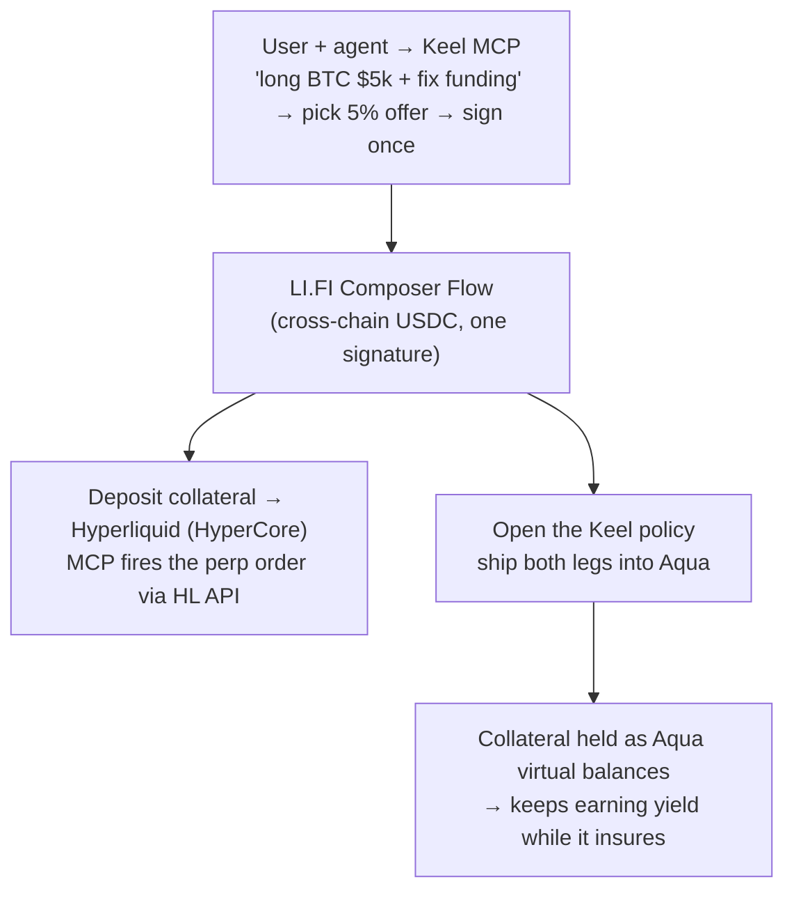
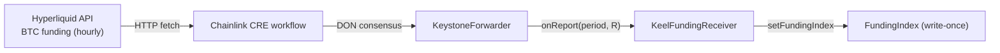
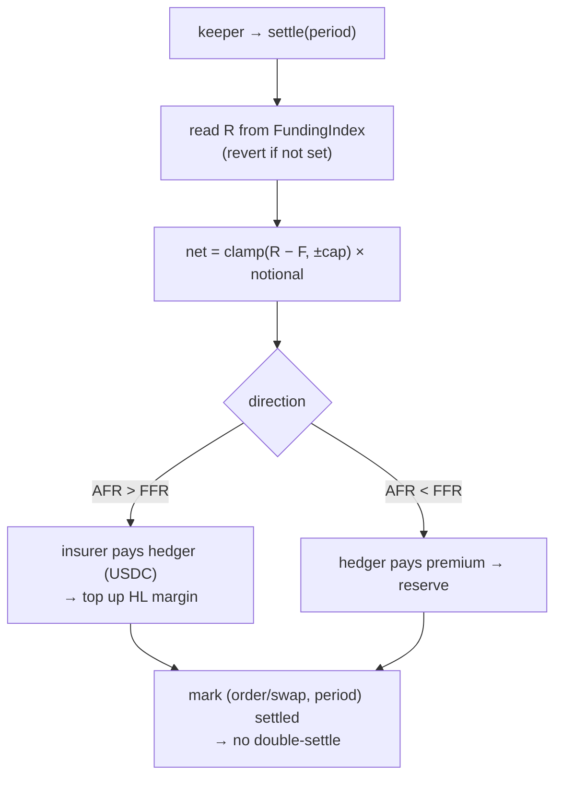

# Keel — Flows & Interactions

> The canonical, end-to-end description of how Keel works: who the actors are, what a user does, and
> what the system does each period. **This is the single source of truth for "how it works."** The
> [`design-doc.md`](design-doc.md) holds the deeper economic/risk analysis; [`bounty-integrations.md`](bounty-integrations.md)
> holds the per-sponsor code.
>
> **Chain:** Base mainnet (chain id 8453) — real funds/gas; keep demo position sizes small.
> **Funding source:** Hyperliquid (read by Chainlink, never touched by the Keel contract).

---

## The one-sentence model

**Keel is insurance on your funding rate.** You hold a perp on Hyperliquid and pay a *variable* funding
fee every hour; Keel sells you a policy that pins that cost to a *fixed* rate. If real funding spikes, the
protocol pays you the difference (and tops your margin back up); if it stays calm, you pay the premium.
Your net funding cost stays flat.

The protocol is the **insurer**: it pays you from a **pre-funded, capped reserve** and earns the premium
when funding is calm. The reserve's exposure is capped per period and pre-funded up front, so it can
always pay — **no default, by design** (see below). *(In the MVP, we run that reserve; in a mature market,
speculators provide it.)*

---

## The cast

| Actor / component | Role |
|---|---|
| **User + their agent** (Claude Code / Codex / any MCP client) | The **hedger** — a leveraged perp long who wants their funding cost fixed. Speaks in natural language; the agent acts through the Keel MCP. |
| **Keel MCP** | The front door. Reads funding, lists offers, builds the transactions. *Proposes; the human confirms.* |
| **LI.FI Composer** | The on-ramp. Brings the user's USDC cross-chain and opens **both legs** of the hedge in one Flow. |
| **Hyperliquid** | Where the real perp lives (leg 1). Also the **funding-rate data source** (read by Chainlink). |
| **Keel contracts** (Base mainnet) | The insurance policy (leg 2): the `_fundingSettle` Aqua opcode (`KeelSwapVMRouter` + `KeelFundingProgram`). Matching + settlement only — no custody (collateral stays in-wallet as Aqua virtual balances). |
| **1inch Aqua / SwapVM** | The settlement engine. The collateral lives as **virtual balances**, so it keeps earning yield while it backs the policy. |
| **Chainlink CRE** | The thermometer. Reads Hyperliquid funding → DON consensus → writes it on-chain. |
| **Insurance reserve** | The protocol's pre-funded counterparty that pays claims and collects premiums. In the MVP, a **pre-funded team wallet**. |
| **Keeper** | Fires `settle()` once per period. |

**The key separation (read this — it's what everyone gets confused on):** the Keel contract **never
touches your Hyperliquid position.** It settles against a *public number* — the funding rate — like rain
insurance pays on rainfall without controlling the weather. That's why we don't need to build a perp DEX.
The **MCP** is the convenience layer that drives your own Hyperliquid leg via API and mirrors payouts to
it; the **contract** only reads the number and settles.

**Two rates (used everywhere below):**
- **AFR — Actual Funding Rate**: what the market actually charged this period (realized, from Chainlink).
- **FFR — Fixed Funding Rate**: the rate you locked.

---

## A. User flow (what a person experiences)

**1 — Ask, in one conversation.**
> *User → agent:* "Open a $5,000 BTC long on Hyperliquid and fix my funding rate."

**2 — Pick a policy.** The MCP lists the insurer's standing offers, each a `{fixed rate, max coverage}`:
- 5% fixed · $25k max coverage
- 10% fixed · $50k max coverage
- 15% fixed · $100k max coverage

*(Max coverage = the ceiling the insurance can pay out = `cap × notional`.)*

**3 — Choose + sign once.**
> *User:* "The 5% one." → *MCP:* "Done — sign once." → **one signature.**

**4 — Position live.** Both legs are open. The user's collateral is locked as the insurance premium pool
and **lives in Aqua, earning yield** while it backs the policy. A minimal panel shows: the Hyperliquid
position, the Keel position, the collateral in Aqua, **FFR = 5%**, and **AFR live**.

**5 — The per-period loop (the policy at work).** Each period (hourly; compressed in the demo):
- **AFR > FFR** — funding spiked and is draining your perp margin → **the protocol pays you** the
  difference in USDC, routed to top up your Hyperliquid margin. *The claim payout.*
- **AFR < FFR** — funding is below your locked rate → **you pay the premium** from your collateral into
  the protocol's reserve. *The cost of certainty.*

Either way, your **net funding cost stays pinned at 5%.**

**6 — The end.** The loop runs until you close, or until the **brink** — your collateral can no longer
cover one more worst-case period (`remaining < cap × notional`). Keel does **not** close blindly: the
agent **proposes** three options — **close · re-match · top up (continue)** — and **you confirm** with a
signature. *Agent proposes, the human decides.*

---

## B. System flow (what happens under the hood)

### B.0 — What's live (build against this)

The intersection between the CRE write path and the Aqua read path is a **single shared contract,
`FundingIndex`** — CRE writes `(period → R)`, the `_fundingSettle` opcode reads it. Build against:

| Thing | Value |
|---|---|
| `FundingIndex` (the seam) | `0x545f162204A92CEbeb12AA0A4AaDF777d6905005` (Base mainnet) — **the Aqua order's `fundingIndex` must point here** |
| `KeelFundingReceiver` (CRE consumer) | `0x7b7Ca2269f865C3448015173D433CcD7782aF582` |
| `PERIOD_SECONDS` | **3600** (must match in the order) |
| Settlement token (`tokenOut`) | canonical Base USDC `0x833589fCD6eDb6E08f4c7C32D4f71b54bdA02913` |
| Aqua (canonical, reused) | `0x499943E74FB0cE105688beeE8Ef2ABec5D936d31` |
| Aqua settlement layer (router + program + position token) | **not deployed yet** → `script/DeployAqua.s.sol` (points orders at the live `FundingIndex`; does **not** redeploy it) |

The CRE write path is **live and verified on-chain** (real Hyperliquid funding written into `FundingIndex`).
What remains is deploying the Aqua settlement layer and wiring open/ship + a keeper (see §D).

### B.1 — Onboarding (one user signature)

*Both legs are funded with **real USDC**: LI.FI bridges the user's USDC cross-chain and **deposits** into
both — the Hyperliquid perp margin **and** the Keel leg (shipped into Aqua). The perp order itself is fired
by the MCP via the Hyperliquid API in the same flow — LI.FI does not place the order. Because settlement is
real USDC, the `AFR > FFR` payout can **literally** top up the HL margin (no token mismatch).*
*Open item (integration lead): confirm the Composer Flow can chain the Aqua `ship` call after the bridge in
one Flow; else two sequenced calls behind one MCP confirmation.*

### B.2 — The oracle (each period)

- The CRE workflow reads Hyperliquid's `funding` (already an **hourly** fractional rate) and scales it to a
  **signed `1e18` per-period** value **off-chain** (`toScaled1e18`); the contract only ever sees `R` as that
  per-period `1e18` value — never an annualized rate.
- `period = floor(unixSeconds / PERIOD_SECONDS)`. **The live deployment uses `PERIOD_SECONDS = 3600`** (the
  hourly funding window) — this is the value baked into the deployed CRE config, so the Aqua order **must be
  built with the same `3600`** or the opcode reads a different period bucket than CRE wrote. *(To compress
  the demo, lower `PERIOD_SECONDS` on **both** the CRE config and the order together; the relayer fallback
  can then latch periods quickly.)*
- The index is **write-once** per period (immutable once it has settled real cashflow). Only the
  `KeelFundingReceiver` may write it; it accepts an owner-rotatable **EOA relayer** as a liveness fallback
  if the DON is flaky.

### B.3 — Settlement (each period, fired by the keeper)

The settlement amount is `net = clamp(realized − fixed, ±cap) × notional`:
- `R > F` → the insurer pays the hedger;
- `R < F` → the hedger pays the premium;
- `R = F` → nothing moves.

**On the Aqua opcode path** (`_fundingSettle`), settlement is **directional** and **bound to the agreed
counterparty**: because SwapVM is one-directional (maker → taker), a Keel policy is implemented as **two
mirror orders** — one pays when `realized > fixed` (`makerPaysAbove = true`), the other when `realized <
fixed`. Each order pays `0` outside its own direction, so no side is ever debited the wrong way, and each
order reverts (`UnauthorizedTaker`) if anyone but the agreed counterparty tries to take it.

**Tokens at settlement:** the swap's `tokenOut` is **canonical Base USDC** `0x8335…2913` (real USDC — the
token the Base-mainnet fork test moves); `tokenIn` is a non-USDC **position-marker** ERC20 (amountIn 0, so
SwapVM's `tokenIn != tokenOut` invariant holds). Collateral is shipped into Aqua as a **virtual balance**
and only the netted USDC is pulled/pushed at settlement, so it stays in-wallet until the moment it moves.
*(An early `MockUSDC 0x3A51…c6e8` was deployed but is superseded — settlement is real USDC.)*

### No default, by design

1. **Capped per period** — the most that can move in one period is `cap × notional` (the venue funding
   clamp), so the worst case is bounded.
2. **Pre-funded** — each side locks at least that worst case up front, so the first period is always
   covered and settlement can never overdraw a balance (it reverts instead of creating unbacked debt).
3. **Conserved** — settlement only *moves* collateral between the two sides; the total is never created.
   A credited party is always backed by tokens the contract actually holds.

So if one side is ever drained, **only that side closes — the other is paid in full.**

---

## C. The MCP tool surface

- **Read:** `get_funding(market)` (AFR via Chainlink), `list_offers()` (the insurer's fixed-rate offers),
  `get_position(addr)`, `preview_settle(swapId, realized)`.
- **Open (user-signed):** `open_hyperliquid_position(market, side, size)` (HL API) +
  `open_keel_position(offerId)` (approve Aqua + `ship` the leg via `KeelFundingProgram`/`KeelSwapVMRouter`).
- **Settle (routine, keeper/agent):** the bound taker calls `KeelSwapVMRouter.swap` over the shipped
  order for the period → on `AFR > FFR`, `topup_hyperliquid_margin(...)`.
- **Gated (brink, user-confirmed):** `propose_decision(swapId)` → returns the *unsigned* close / top-up /
  re-match tx for the user to confirm.

There is **no AI in the settlement math** — the agent builds the transactions, the contract computes the
cashflow deterministically, and at the brink the **human confirms**.

---

## D. MVP / demo scope vs roadmap

| Capability | Status |
|---|---|
| MCP conversation → 3 offers → one signature | **Demo** |
| LI.FI Composer opens both legs; collateral earns in Aqua | **Demo** |
| **One real settlement tick** (AFR > FFR → protocol pays real USDC) on Base mainnet | **Demo** |
| The full per-period loop running hour after hour | Roadmap (narrated) |
| The **brink** decision (agent proposes → human confirms) | Roadmap (narrated) |
| Speculators replacing the team-run reserve | Phase 2 |
| Cumulative funding index (lazy/range settlement) | Roadmap |

**Real vs scripted (say it on stage):** the swap, the collateral in Aqua, the settlement, and the USDC
movement are **real** (Base mainnet). The realized funding value (`AFR`) in the demo is **injected** —
it's exactly what Chainlink CRE posts from Hyperliquid, scripted high to show the `AFR > FFR` payout. The
Ethena / Oct-10 figures are **real historical data**.
