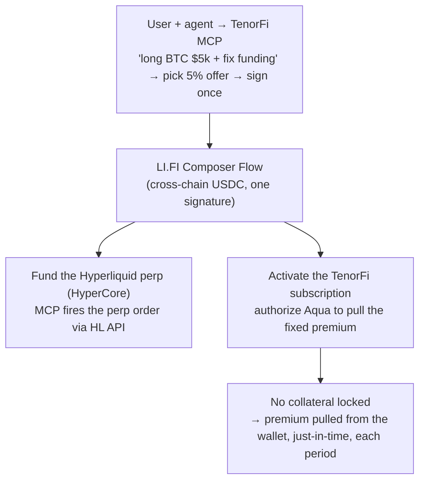
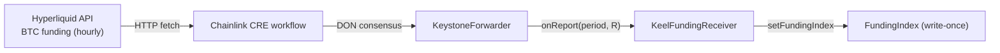
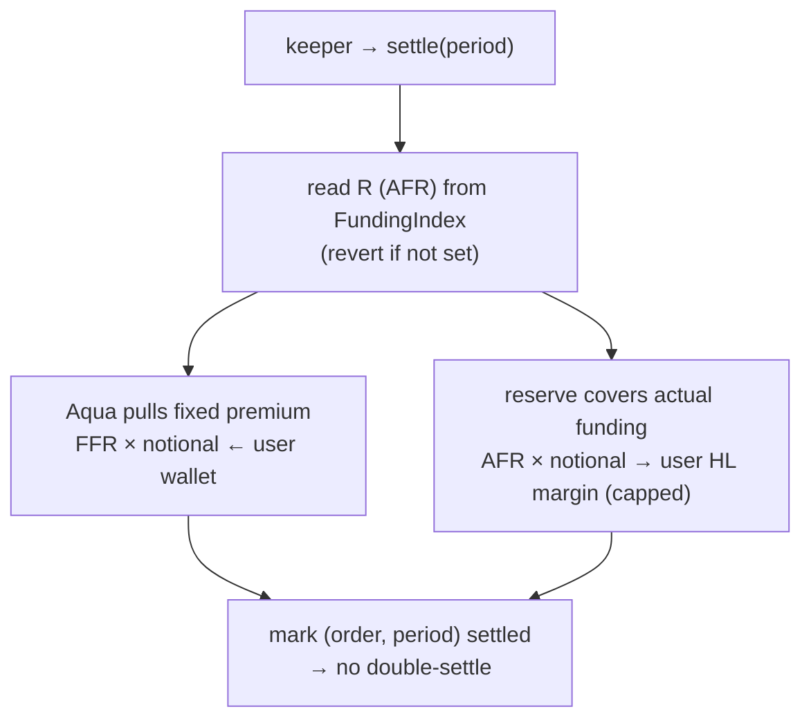

# TenorFi — Flows & Interactions

> The canonical, end-to-end description of how TenorFi works: who the actors are, what a user does, and
> what the system does each period. **This is the single source of truth for "how it works."** The
> [`design-doc.md`](design-doc.md) holds the deeper economic/risk analysis; [`bounty-integrations.md`](bounty-integrations.md)
> holds the per-sponsor code.
>
> **Chain:** Base mainnet (chain id 8453) — real funds/gas; keep demo position sizes small.
> **Funding source:** Hyperliquid (the funding rate is read on-chain by Chainlink CRE).

> ⚠️ **Design direction (current).** This describes the **subscription / just-in-time-premium** model:
> the user posts **no collateral**, 1inch Aqua pulls a **fixed premium** from their wallet each hour, and
> TenorFi **covers their actual funding** on Hyperliquid. The **deployed** Base contracts still implement the
> *prior* model — **net** `(R − F)` settlement from **pre-shipped Aqua virtual balances** — so the
> on-chain code is mid-migration. Don't present the subscription model as fully live on-chain until the
> contracts ship. (Synced with the team — see §B.0 for what's actually deployed today.)

---

## The one-sentence model

**TenorFi is a subscription that fixes your funding rate.** You hold a perp on Hyperliquid and owe a
*variable* funding fee every hour. **TenorFi covers that fee for you** — and in exchange you pay a **fixed
premium** (e.g. 7.3% APR → the per-hour amount). The premium is pulled straight from your wallet by **1inch
Aqua, just-in-time** (the hour before each funding payment), so **you lock up no collateral**. Your net
funding cost is the fixed rate, flat.

The protocol is the **insurer**: it covers your funding from a **pre-funded, capped reserve** and keeps the
premium when funding is calm. The reserve's exposure is capped per period and pre-funded up front, so it can
always pay — **no default, by design** (see below). *(In the MVP, we run that reserve; in a mature market,
speculators provide it.)*

---

## The cast

| Actor / component | Role |
|---|---|
| **User + their agent** (Claude Code / Codex / any MCP client) | The **hedger** — a leveraged perp long who wants their funding cost fixed. Speaks in natural language; the agent acts through the TenorFi MCP. |
| **TenorFi MCP** | The front door. Reads funding, lists offers, builds the transactions, routes the funding coverage to the user's HL margin. *Proposes; the human confirms.* |
| **LI.FI Composer** | The on-ramp. Brings the user's USDC cross-chain to fund the **Hyperliquid perp** and authorize the **TenorFi subscription** in one Flow. |
| **Hyperliquid** | Where the real perp lives (leg 1). Also the **funding-rate data source** (read by Chainlink). |
| **TenorFi contracts** (Base mainnet) | The subscription engine (leg 2): the `_fundingSettle` Aqua opcode (`TenorSwapVMRouter` + `TenorFundingProgram`). Pulls the fixed premium from the user's wallet via Aqua each period — **no custody, no user-posted collateral**. |
| **1inch Aqua / SwapVM** | The settlement engine. **Pulls the fixed premium directly from the user's wallet, just-in-time each period — the user locks up nothing.** |
| **Chainlink CRE** | The thermometer. Reads Hyperliquid funding → DON consensus → writes it on-chain — the **actual funding TenorFi must cover**. |
| **Insurance reserve** | The protocol's pre-funded counterparty that **covers the user's funding** and collects the premium. In the MVP, a **pre-funded team wallet**. |
| **Keeper** | Fires `settle()` once per period (pull the premium + cover the funding). |

**The core idea (what makes it different):** **you lock up no collateral.** Strips/IPOR make you post
margin that sits dead for weeks; TenorFi pulls a small **fixed premium** from your wallet each hour — pay as
you go — and **covers your actual funding** in return. TenorFi reads the funding rate on-chain via Chainlink to
know exactly what to cover; the MCP routes the coverage to your Hyperliquid margin so your net cost stays
pinned at the fixed rate.

**Two rates (used everywhere below):**
- **AFR — Actual Funding Rate**: what the market actually charged this period (realized, from Chainlink).
- **FFR — Fixed Funding Rate**: the rate you locked (your fixed premium).

---

## A. User flow (what a person experiences)

**1 — Ask, in one conversation.**
> *User → agent:* "Open a $5,000 BTC long on Hyperliquid and fix my funding rate."

**2 — Quote.** The MCP returns a single quote, a `{fixed rate, coverage}`. **The fixed rate is 7.3% APR** — the fair/break-even rate from a year of real BTC funding. **Coverage auto-scales to ≈ 1.5% of the position** — for this $5,000 long that's ~**$75**, pre-funded by the reserve.

*(**Coverage = the reserve's pre-locked collateral** = its cumulative payout budget over the swap's life, ≈ 1.5% of notional — **not** `cap × notional` (that is only the per-period clamp). One fixed rate for everyone; coverage is set by the position size. The 7.3% rate, the cap and the 1.5% sizing are all validated against a year of real BTC funding — `docs/research/analysis.md`. The user posts none of the coverage.)*

**3 — Confirm + sign once.**
> *User:* "Do it." → *MCP:* "Done — sign once." → **one signature** (opens the perp + authorizes the
> Aqua premium pulls).

**4 — Position live.** The perp is open and the TenorFi subscription is active. **No collateral is locked** —
the user simply authorized Aqua to pull the fixed premium each period. A minimal panel shows: the
Hyperliquid position, **FFR = 7.3%**, **AFR live**, and the next premium due.

**5 — The per-period loop (the subscription at work).** Each period (hourly; compressed in the demo):
- **Aqua pulls the fixed premium** (`FFR × notional`) straight from the user's wallet — just-in-time, the
  hour before funding is due.
- **TenorFi covers the user's actual funding** (`AFR × notional`), routed to top up their Hyperliquid margin.

So whether **AFR > FFR** (funding spiked — the reserve eats the gap) or **AFR < FFR** (funding calm — the
reserve keeps the spread), the user's **net funding cost stays pinned at 7.3%.**

**6 — The end.** The subscription runs until you close, or until the **brink** — your wallet can't fund the
next premium pull. TenorFi does **not** close blindly: the agent **proposes** three options — **close ·
re-match · top up your wallet (continue)** — and **you confirm** with a signature. *Agent proposes, the
human decides.*

---

## B. System flow (what happens under the hood)

### B.0 — What's live (build against this)

The intersection between the CRE write path and the Aqua read path is a **single shared contract,
`FundingIndex`** — CRE writes `(period → R)`, the `_fundingSettle` opcode reads it. Build against:

| Thing | Value |
|---|---|
| `FundingIndex` (the seam) | `0x545f162204A92CEbeb12AA0A4AaDF777d6905005` (Base mainnet) — **the Aqua order's `fundingIndex` must point here** |
| `KeelFundingReceiver` (CRE consumer) | `0x7b7Ca2269f865C3448015173D433CcD7782aF582` |
| `PERIOD_SECONDS` | **3600** (must match in the order) |
| Settlement token (`tokenOut`) | canonical Base USDC `0x833589fCD6eDb6E08f4c7C32D4f71b54bdA02913` |
| Aqua (canonical, reused) | `0x499943E74FB0cE105688beeE8Ef2ABec5D936d31` |
| Aqua settlement layer (router + program + position token) | deploys with the rest of the stack in one shot via `script/Deploy.s.sol` |

The CRE write path is **live and verified on-chain** (real Hyperliquid funding written into `FundingIndex`).
What remains is wiring the subscription premium-pull + funding-coverage settlement and a keeper (see §D).
*(The deployed opcode currently settles the **net** `(R − F)` from pre-shipped balances; the premium-pull /
coverage split below is the migration — see the banner at the top.)*

### B.1 — Onboarding (one user signature)

*LI.FI bridges the user's USDC cross-chain to **fund the Hyperliquid perp margin** and the user **authorizes
the Aqua premium pulls** — the perp order itself is fired by the MCP via the Hyperliquid API in the same
flow (LI.FI does not place the order). The user **deposits no collateral into TenorFi**; the premium is pulled
from their wallet only when due.*
*Open item (integration lead): confirm the Composer Flow can chain the Aqua authorization after the bridge in
one Flow; else two sequenced calls behind one MCP confirmation.*

### B.2 — The oracle (each period)

- The CRE workflow reads Hyperliquid's `funding` (already an **hourly** fractional rate) and scales it to a
  **signed `1e18` per-period** value **off-chain** (`toScaled1e18`); the contract only ever sees `R` as that
  per-period `1e18` value — never an annualized rate.
- `period = floor(unixSeconds / PERIOD_SECONDS)`. **The live deployment uses `PERIOD_SECONDS = 3600`** (the
  hourly funding window) — this is the value baked into the deployed CRE config, so the Aqua order **must be
  built with the same `3600`** or the opcode reads a different period bucket than CRE wrote. *(To compress
  the demo, lower `PERIOD_SECONDS` on **both** the CRE config and the order together; the relayer fallback
  can then latch periods quickly.)*
- The index is **write-once** per period (immutable once it has settled real cashflow). Only the
  `KeelFundingReceiver` may write it; it accepts an owner-rotatable **EOA relayer** as a liveness fallback
  if the DON is flaky.

### B.3 — Settlement (each period, fired by the keeper)

Each period, two flows make the user's cost fixed:
- **Premium in:** Aqua pulls `FFR × notional` from the user's wallet → the reserve.
- **Funding covered:** the reserve sends `AFR × notional` (capped at `cap × notional`) → the user's HL margin.

The reserve's per-period P&L is `(FFR − AFR) × notional`: it keeps the spread when funding is calm and eats
the gap when funding spikes (bounded by the cap). The user's net is always the fixed rate.

> **On-chain today (divergence):** the deployed `_fundingSettle` opcode settles the **net** difference
> `clamp(R − F, ±cap) × notional` from **pre-shipped Aqua virtual balances** (two mirror orders,
> directional, `UnauthorizedTaker`-bound, double-settle guarded) — it does **not** yet split the
> premium-pull from the coverage, and the user still ships a balance. Economically the net is the same; the
> subscription split (zero user collateral, premium pulled just-in-time) is the migration. See
> [`bounty-integrations.md`](bounty-integrations.md) for the deployed opcode.

### No default, by design

1. **Capped per period** — the most the reserve covers in one period is `cap × notional` (the venue funding
   clamp), so the worst case is bounded.
2. **Reserve pre-funded** — the reserve holds at least that worst case up front, so coverage can never
   overdraw (a payout that would exceed the reserve reverts instead of creating unbacked debt).
3. **The user holds nothing to lose** — if their wallet can't fund the next premium pull, the position
   simply **closes**; there is no user collateral to drain. The user's only obligation is to have the small
   fixed premium in their wallet at each pull.

So default risk lives only on the insurer's side, and it's bounded + pre-funded.

---

## C. The MCP tool surface

- **Read:** `get_funding(market)` (AFR via Chainlink), `list_offers()` (the insurer's fixed-rate offers),
  `get_position(addr)`, `preview_settle(swapId, realized)`.
- **Open (user-signed):** `open_hyperliquid_position(market, side, size)` (HL API) +
  `open_keel_position(offerId)` (authorize Aqua to pull the premium via `TenorFundingProgram`/`TenorSwapVMRouter`
  — no collateral deposit).
- **Settle (routine, keeper/agent):** the bound taker calls `TenorSwapVMRouter.swap` over the order for the
  period (Aqua pulls the premium); the reserve covers the funding → `topup_hyperliquid_margin(...)`.
- **Gated (brink, user-confirmed):** `propose_decision(swapId)` → returns the *unsigned* close / top-up /
  re-match tx for the user to confirm.

There is **no AI in the settlement math** — the agent builds the transactions, the contract computes the
cashflow deterministically, and at the brink the **human confirms**.

---

## D. MVP / demo scope vs roadmap

| Capability | Status |
|---|---|
| MCP conversation → 3 offers → one signature | **Demo** |
| LI.FI Composer funds the perp + activates the subscription (no user collateral) | **Demo** |
| **One real settlement tick** (Aqua pulls the premium; reserve covers funding) on Base mainnet | **Demo** |
| The full per-period loop running hour after hour | Roadmap (narrated) |
| The **brink** decision (agent proposes → human confirms) | Roadmap (narrated) |
| Subscription split deployed on-chain (premium-pull vs net) | Roadmap (migration — see banner) |
| Speculators replacing the team-run reserve | Phase 2 |

**Real vs scripted (say it on stage):** the swap, the premium pull, the settlement, and the USDC movement
are **real** (Base mainnet). The realized funding value (`AFR`) in the demo is **injected** — it's exactly
what Chainlink CRE posts from Hyperliquid, scripted to show the coverage. The Ethena / Oct-10 figures are
**real historical data**.
