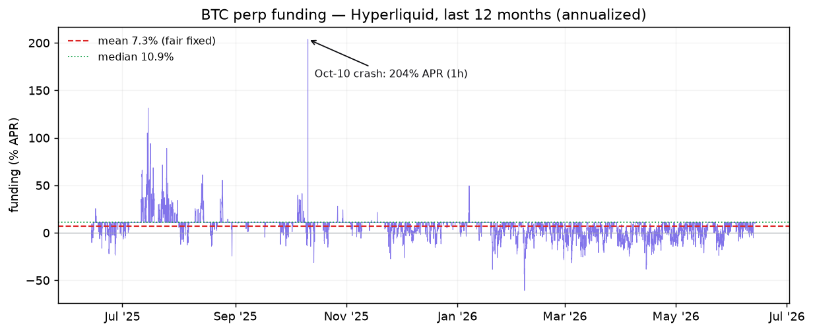
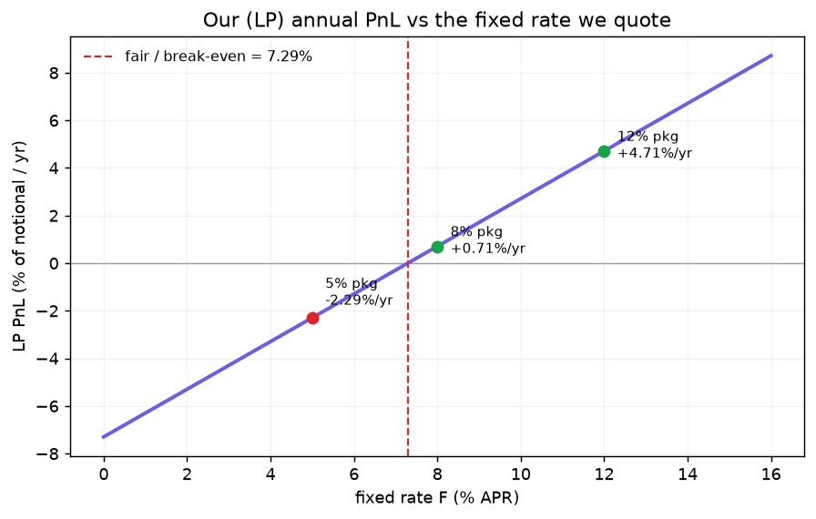
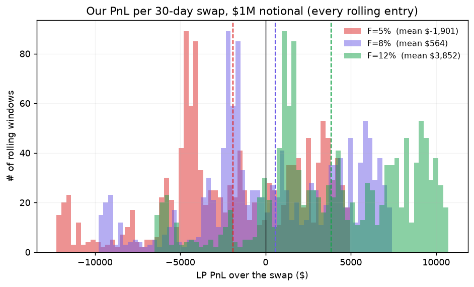

# TenorFi — Funding-rate backtest sobre data real (Hyperliquid BTC, 12 meses)

> **🔒 Decisión de producto (locked):** **un solo fixed rate = 7.3% APR** y **coverage = 1.5% de
> la posición del perp** (auto-escalado). El análisis comparativo de 5/8/12% que aparece abajo es
> la **evidencia** que derivó el 7.3% (el fair/break-even) — **no son ofertas** del producto.
>
> **Qué es esto:** un backtest del funding **real** de BTC en Hyperliquid de los últimos 12
> meses (jun-2025 → jun-2026, **8.766 horas, sin gaps**) para responder con datos: ¿qué fixed
> rate habría funcionado mejor, cuánto coverage es óptimo, y cuánta plata habríamos ganado o
> perdido por paquete? Reemplaza al Monte Carlo sintético (`keel_sim.py`).
>
> **Reproducir:** `cd docs/research && python fetch_funding.py && python backtest.py && python make_report.py`
> Data: `funding_btc_1y.csv`. Motor: `backtest.py`. Gráficos: `funding_1y.png`, `pnl_vs_F.png`, `pnl_distribution.png`.
>
> **Lado del análisis:** todo desde **nuestro lado (LP / reserva de seguro)** — recibimos el
> fijo, pagamos el flotante. Reconcilia con `KeelSwap.sol:199-224` (`net = realized − fixed`, clamp).

---

## 1. La realidad del funding de BTC (lo que pasó de verdad)

| Métrica | Valor (anualizado) |
|---|---|
| **Media** | **7.29% APR** |
| Mediana | 10.95% APR |
| p5 / p95 | −9.7% / +13.4% |
| p1 / p99 | −19.3% / +39.3% |
| Máximo (1 hora) | **203.8% APR** — el **10-oct-2025** (el crash) |
| Mínimo (1 hora) | −60.8% APR |
| Horas con funding **negativo** | **17.7%** |

**Lo clave para entender todo lo demás:** la **media (7.3%) es menor que la mediana (11%)**.
La hora típica de BTC paga ~11% APR (longs pagan a shorts, el baseline estructural), pero hay
muchas horas de funding **negativo** (sell-offs donde shorts pagan a longs, hasta −60% APR) que
arrastran el promedio a 7.3%. **El verano 2025 tuvo funding alto y sostenido** (spikes de 50–130%
APR); **2026 tuvo mucho funding negativo.** Esa textura es la que hace que el negocio funcione.

---

## 2. ¿Qué fixed rate habría funcionado mejor? → **Fair = 7.3% APR**

Como LP, nuestro PnL anual ≈ **`F − 7.29%`** del notional (el clamp por período nunca muerde —
ver §4 — así que la relación es casi perfectamente lineal):

| Fixed rate `F` | Nuestro PnL anual (% del notional) | Lectura |
|---|---|---|
| 3% | −4.30%/yr | regalamos el seguro |
| **5%** (paquete demo) | **−2.29%/yr** | **por debajo del fair → perdemos** |
| **7.29%** | **±0.00%** | **break-even — el rate justo** |
| **8%** (paquete) | **+0.71%/yr** | ~fair + spread chico ✅ |
| 10% | +2.71%/yr | rico |
| **12%** (paquete) | **+4.71%/yr** | caro para el hedger, muy rentable p/nosotros |

**El fair rate es 7.3% APR.** Es el número defendible en Q&A: *"cotizamos cerca del funding
promedio realizado, no apostamos direccionalmente; ganamos el spread."* (Es exactamente la
definición `F ≈ E[R]` del design-doc, ahora con data real, no asumida.)

> ⚠️ **Hallazgo para el pitch:** el paquete de **5% está por debajo del fair (7.3%)** — con ese
> rate, **nosotros (el LP) perdemos ~2.3%/año del notional**. Es un *"loss leader"*: excelente
> para el hedger y perfecto para la narrativa de demo (*"el funding subió, el protocolo te paga"*),
> pero **no es un rate rentable**. El **paquete de 8% es el más cercano al break-even rentable.**
> Si querés que los 3 paquetes ganen plata, deberían rondar **8% / 10% / 12%**, no 5/8/12.

---

## 3. ¿Cuánto coverage? → **auto-escala: 1.5% del notional**

`coverage` = nuestro colateral pre-lockeado (= `speculatorCollateral`, **no** `cap×notional`) =
presupuesto **acumulado** de lo que podemos pagarle al usuario antes de drenarnos.

**El coverage no es un número fijo como el rate — es una propiedad de cada swap que escala con
el notional.** Decisión de producto (Q&A): **coverage auto-escalado = 1.5% del notional**, para
posiciones chicas del demo ($1k–$100k). Validado contra la data: el peor drawdown acumulado al
**p99 sobre 30 días al fair (7.3%) es 1.02% del notional** — la regla de **1.5% lo cubre con
1.5× de margen.**

| Notional de la posición | **Coverage a pre-lockear** (1.5%) |
|---|---|
| $1.000 | **$15** |
| $5.000 | **$75** |
| $10.000 | **$150** |
| $25.000 | **$375** |
| $50.000 | **$750** |
| $100.000 | **$1.500** |

**Ajustes al ratio:**
- **Tenor:** 1.5% cubre swaps de **hasta ~30 días**. Si la posición corre hasta un año → **~3%**.
- **Pricing:** vale al fair o por encima (≥7.3%). Si ofrecés un loss-leader **por debajo** del
  fair (ej. 5%) → **~2%** (pagás más seguido).
- **Piso por período:** `cap×N` con un cap realista (~0.05%/h) = 0.05% del notional, muy por
  debajo del 1.5% acumulado → manda el 1.5%. (Con el cap de venue 4% el piso te obligaría a 4% —
  otra razón para bajar el cap, ver §4.)

> Los **tiers fijos** del pitch viejo ($25k/$50k/$100k) implican notionals de **~$2M / $5M /
> $15M** — escenario de producto maduro, no del demo chico. Para el demo, auto-escala.

**Distribución del PnL por swap de 30 días (por $1M de notional), a los 3 rates de referencia:**

| Rate | PnL medio / swap 30d / $1M | Cola |
|---|---|---|
| 5% | **−$1,901** (mayoría negativos) | hasta −$12k en meses de funding alto |
| 8% | **+$564** (centrado en ~0) | simétrica |
| 12% | **+$3,852** (mayoría positivos) | igual hay meses perdedores (−$7k) |

---

## 4. El cap por período: el de venue (4%/h) es ~180× más grande de lo necesario

| | por hora | anualizado |
|---|---|---|
| Movimiento real `\|R−F\|` p95 | 0.0024% | — |
| p99 | 0.0041% | 36% APR |
| p99.9 | 0.0094% | — |
| **Máximo de todo el año** (Oct-10) | **0.0224%** | **196% APR** |
| **Cap de venue (Hyperliquid)** | **4.0%** | 35.040% APR |

**El peor movimiento horario de los 12 meses fue 0.0224%/h — el cap de venue (4%/h) es ~180×
más grande y nunca se activa.** Esto es directamente **tu edge de capital-efficiency**: el cap
fija el colateral mínimo por período (`cap×N`). Con el cap de venue, $1M de notional exige $40k
pre-lockeados por período; con un cap realista de **~0.05%/h** (cubre el máximo histórico con
margen ×2), exige **$500**. **~80× menos colateral muerto.**

> **Recomendación de cap:** **NO** usar el p99 (0.0041%/h) — dejaría descubierta justo la hora
> del crash (el cap existe para la cola). Usar **~0.05%/h** (cubre el máximo histórico de Oct-10
> con holgura). Es el balance entre capital-efficiency (tu pitch) y proteger al hedger en el
> peor caso real. *(On-chain: cambiar `cap` de `4e16` a ~`5e14`.)*

---

## 5. Crash replay (semana del 10-oct-2025) — y una nota de honestidad

Backtest sobre la semana del crash, F=5%, $1M notional:
- Funding promedio de la semana: **12.6% APR**; pico: **203.8% APR** (1 hora).
- Horas en que `AFR > FFR` (pagamos): **151 / 168**.
- Nuestro PnL esa semana: **−$1,455** (−0.15% del notional).

> ⚠️ **Honestidad para el pitch:** el crash del 10-oct fue un crash de **precio/liquidaciones**,
> no un crash de **funding sostenido**. El funding spikeó a 203% APR por **una hora** y volvió;
> el promedio semanal fue solo 12.6% APR. El beat de demo *"AFR > FFR → el protocolo te paga"*
> **es real** (pagamos 151 de 168 horas), pero el **monto es modesto** ($1,455 sobre $1M en la
> semana). **El escenario que de verdad drena coverage es el funding alto y sostenido (el verano
> 2025, estilo Ethena), no el spike de una hora.** Decí "tu *rate* quedó fijo", no "te pagamos
> una fortuna" — el valor es la **certeza**, no la magnitud del payout en un día.

---

## 6. Conclusiones (para el pitch y para calibrar los paquetes)

1. **Fair rate = 7.3% APR** (data real, no asumido). Es el ancla defendible.
2. **Los paquetes 5/8/12 no son todos rentables:** 5% pierde 2.3%/yr (loss leader / demo), 8%
   apenas gana, 12% gana 4.7%/yr. Para que los 3 ganen, mover a **~8/10/12%**.
3. **Coverage auto-escalado = 1.5% del notional** (no un absoluto). Validado: cubre el p99 real
   (1.02%) con margen. $100k de posición → $1.500 de coverage; $5k → $75. Tiers fijos $25k/$50k/
   $100k = producto maduro (~$2M/$5M/$15M de notional).
4. **Bajar el cap de 4%/h a ~0.05%/h** → ~80× menos colateral muerto, sin perder protección en
   el peor caso histórico. Es tu argumento de capital-efficiency, cuantificado.
5. **El motor queda reutilizable:** `python backtest.py --F 8 --coverage 50000 --notional 1000000`
   da el PnL de cualquier combinación. Para el demo, anclá el discurso en la *certeza del rate*,
   no en payouts grandes.
